# Architecture Breakdowns — _Designing Data-Intensive Applications_

Structured notes on [_Designing Data-Intensive Applications_](https://learning.oreilly.com/library/view/designing-data-intensive-applications/9781491903063/preface01.html) by **Martin Kleppmann** (O'Reilly, 2017).

Phase 1 deliverable for **Systems Engineering Foundations**. These notes follow the study approach from my DDIA reading guide: treat the book as a **systems-design mental model framework**, not a textbook to memorize.

**Primary reference:** [O'Reilly — Designing Data-Intensive Applications](https://learning.oreilly.com/library/view/designing-data-intensive-applications/9781491903063/preface01.html)

---

## How to Use These Notes

### The Right Mindset

Do not ask: _"Can I remember every detail?"_

Ask instead:

> Can I recognize and reason about these architectural problems when I see them?

That is the skill that matters for AI platforms, distributed systems, observability, and scalable data ecosystems.

### Three Parallel Study Layers

| Layer             | Goal                                         |
| ----------------- | -------------------------------------------- |
| **Conceptual**    | Understand distributed systems principles    |
| **Architectural** | Learn tradeoffs and patterns                 |
| **Applied**       | Relate concepts to AI/data platform projects |

### After Every Chapter, Ask

**"What breaks at scale?"**

That question is the central mindset of distributed systems engineers, AI infrastructure engineers, and platform architects.

### Note Format: Tradeoff Notebook

Each chapter breakdown tracks:

| Topic | Problem | Tradeoff | Real-World Example |
| ----- | ------- | -------- | ------------------ |

This develops architect-level thinking — not passive summaries.

---

## Book Overview

### Why This Book Exists

From the [preface](https://learning.oreilly.com/library/view/designing-data-intensive-applications/9781491903063/preface01.html), Kleppmann wrote DDIA to cut through buzzwords (NoSQL, Big Data, sharding, eventual consistency, CAP, MapReduce) and explain **what actually changed** in how we build data systems:

- Internet-scale companies forced new tools for volume and traffic
- Businesses need agility, short dev cycles, and flexible data models
- Open source replaced much bespoke enterprise software
- CPU clock speeds plateaued; **parallelism** and **multi-core** dominate
- IaaS (AWS, etc.) makes geographically distributed systems accessible to small teams

### Book Structure

| Part                               | Chapters | Theme                                                        |
| ---------------------------------- | -------- | ------------------------------------------------------------ |
| **I. Foundations of Data Systems** | 1–4      | Reliability, data models, storage engines, encoding          |
| **II. Distributed Data**           | 5–9      | Replication, partitioning, transactions, failures, consensus |
| **III. Derived Data**              | 10–12    | Batch processing, stream processing, future of data systems  |

### Priority Chapters for AI Platform Work

Not every chapter needs equal depth on first pass. Prioritize:

| Priority | Chapter                                  | Why                                             |
| -------- | ---------------------------------------- | ----------------------------------------------- |
| ★★★      | Ch. 1 — Reliable, Scalable, Maintainable | Foundation for all system design                |
| ★★★      | Ch. 5 — Replication                      | Distributed AI, observability, multi-region     |
| ★★★      | Ch. 6 — Partitioning                     | Embedding stores, streaming, scalable inference |
| ★★★      | Ch. 9 — Consistency & Consensus          | Real distributed systems intuition              |
| ★★★      | Ch. 10–11 — Batch & Stream Processing    | AI pipelines, agents, observability             |
| ★★☆      | Ch. 2 — Data Models                      | Semantic layers, retrieval, metadata            |
| ★★☆      | Ch. 3 — Storage & Retrieval              | Vector DBs, warehouse architecture              |
| ★★☆      | Ch. 7 — Transactions                     | Governance, consistency, AI trust               |
| ★★☆      | Ch. 8 — Trouble with Distributed Systems | Partial failures, clocks, networks              |
| ★☆☆      | Ch. 4 — Encoding & Evolution             | API contracts, schema evolution                 |
| ★☆☆      | Ch. 12 — Future of Data Systems          | Unbundled databases, event-driven design        |

### Recommended Study Pace

| Week | Focus                                       |
| ---- | ------------------------------------------- |
| 1    | Ch. 1–2 + architecture notes                |
| 2    | Ch. 3–4 + storage experiments               |
| 3    | Ch. 5–6 + replication/partitioning diagrams |
| 4    | Ch. 7–9 + consistency tradeoffs             |
| 5    | Ch. 10–11 + event streaming                 |
| 6    | Build mini distributed AI platform          |
| 7+   | Revisit concepts through projects           |

---

## Part I — Foundations of Data Systems

### Chapter 1: Reliable, Scalable, and Maintainable Applications

**Problem the chapter solves:** How do you define and design applications that survive failure, handle growth, and remain operable over time?

#### Core Definitions

| Property            | Meaning                                                            |
| ------------------- | ------------------------------------------------------------------ |
| **Reliability**     | System works correctly even when things go wrong (fault tolerance) |
| **Scalability**     | System copes with increased load gracefully                        |
| **Maintainability** | System is operable, simple, and evolvable over its lifetime        |

#### Tradeoff Notebook

| Topic              | Problem                                           | Tradeoff                                                       | Real-World Example                                     |
| ------------------ | ------------------------------------------------- | -------------------------------------------------------------- | ------------------------------------------------------ |
| Reliability        | Hardware, software, and human errors cause faults | Redundancy and testing cost vs. outage risk                    | Multi-AZ API replicas with health checks               |
| Load description   | "Scalable" is meaningless without defining load   | Specific metrics (QPS, write rate, fan-out) vs. vague capacity | LLM tokens/sec + concurrent sessions, not just "users" |
| Performance        | Latency and throughput often conflict             | Optimize for p99 latency vs. max throughput                    | Streaming first token vs. batch embedding jobs         |
| Vertical scaling   | Bigger machine is simpler                         | Cost ceiling + single point of failure                         | Single GPU node vs. model server pool                  |
| Horizontal scaling | Shared-nothing architecture                       | Operational complexity vs. elastic capacity                    | Kubernetes HPA on API and worker tiers                 |
| Operability        | Ops teams need to run systems daily               | Automation investment vs. manual toil                          | Structured logs + runbooks vs. SSH debugging           |
| Simplicity         | Complexity slows change and causes bugs           | Abstraction layers vs. leaky abstractions                      | One RAG service vs. 6 microservices on day one         |
| Evolvability       | Requirements change                               | Schema flexibility vs. query performance                       | Event-sourced audit log for prompt history             |

#### AI Platform Connection

- **Reliability:** Model server OOM, retrieval timeout, partial RAG failure — design graceful degradation (cached answer, fallback model)
- **Scalability:** Separate scaling dimensions for API, workers, embedder, LLM, vector DB
- **Maintainability:** OpenTelemetry from day one; version prompts and model configs

#### What Breaks at Scale?

- Undefined SLIs (you cannot scale what you do not measure)
- Synchronous chains (API → embed → retrieve → LLM → rerank) without timeouts
- Treating the LLM as the only bottleneck when retrieval or queue depth is the real limit

---

### Chapter 2: Data Models and Query Languages

**Problem the chapter solves:** How do you represent data and express queries — and what are the downstream architectural consequences?

#### Tradeoff Notebook

| Topic                     | Problem                         | Tradeoff                                         | Real-World Example                              |
| ------------------------- | ------------------------------- | ------------------------------------------------ | ----------------------------------------------- |
| Relational model          | Structured data with joins      | Normalization + ACID vs. join cost at scale      | PostgreSQL for users, sessions, billing         |
| Document model            | Flexible schema, nested objects | Locality and agility vs. many-to-many joins      | MongoDB for semi-structured agent state         |
| Graph model               | Highly connected data           | Expressive traversals vs. operational complexity | Knowledge graphs for entity relationships       |
| Declarative queries (SQL) | Hide execution details          | Optimizer leverage vs. opaque performance        | SQL for analytics; EXPLAIN for tuning           |
| Normalization             | Avoid duplication               | Write consistency vs. read join overhead         | Separate `documents` and `chunks` tables in RAG |
| Denormalization           | Read performance                | Faster reads vs. update anomalies                | Embedding metadata duplicated in vector index   |

#### AI Platform Connection

- **RAG metadata:** relational for governance (tenant, ACL, lineage); document for chunk payloads
- **Semantic layers:** declarative metrics (dbt-style) vs. ad-hoc prompt context assembly
- **Agent memory:** graph-like relationships (tools, entities, sessions) vs. flat chat logs

#### What Breaks at Scale?

- Storing full document blobs inside vector metadata (cost + consistency)
- No schema evolution plan when adding reranker scores, model version, or trace IDs to every chunk

---

### Chapter 3: Storage and Retrieval

**Problem the chapter solves:** How do databases physically store and retrieve data — and why do different engines behave so differently?

#### Key Storage Engines

| Engine                 | Structure                       | Strength                         | Weakness                              |
| ---------------------- | ------------------------------- | -------------------------------- | ------------------------------------- |
| **Hash index**         | In-memory hash map + append log | Fast point lookups               | Range queries, large datasets         |
| **SSTable / LSM-tree** | Sorted segments, compaction     | High write throughput            | Read amplification, compaction spikes |
| **B-tree**             | Balanced tree pages             | Predictable reads, range queries | Write amplification on updates        |
| **Column store**       | Column-oriented compression     | Analytics scans                  | OLTP point lookups                    |

#### Tradeoff Notebook

| Topic              | Problem                     | Tradeoff                                      | Real-World Example                         |
| ------------------ | --------------------------- | --------------------------------------------- | ------------------------------------------ |
| OLTP vs. OLAP      | Different access patterns   | Row-oriented vs. column-oriented storage      | Postgres (OLTP) + Snowflake (OLAP)         |
| Indexing           | Fast reads vs. write cost   | More indexes = slower writes                  | pgvector HNSW index rebuild on bulk insert |
| Compaction (LSM)   | Disk space and write speed  | Background compaction vs. read latency spikes | RocksDB-backed KV stores                   |
| Materialized views | Expensive query repeat cost | Stale precomputed results vs. live query cost | Pre-aggregated token usage dashboards      |
| Column compression | Analytics on wide tables    | CPU for decode vs. I/O savings                | Parquet files for training data lakes      |

#### AI Platform Connection

- **Vector DBs:** ANN indexes (HNSW, IVF) are a specialized index structure — understand rebuild cost and recall/latency tradeoffs
- **Embedding pipelines:** LSM-style append + async index build mirrors document ingestion sagas
- **Feature stores / eval datasets:** columnar formats for batch model evaluation

#### What Breaks at Scale?

- Bulk upsert without batching triggers constant index rebuilds
- Mixing OLTP session state and OLAP eval queries on one Postgres instance without read replicas

---

### Chapter 4: Encoding and Evolution

**Problem the chapter solves:** How does data move between processes and evolve over time without breaking consumers?

#### Encoding Formats

| Format                    | Schema          | Evolution                          | Typical use        |
| ------------------------- | --------------- | ---------------------------------- | ------------------ |
| JSON / XML                | Implicit        | Flexible but verbose               | REST APIs, config  |
| Protocol Buffers / Thrift | Explicit IDL    | Forward/backward compatible fields | gRPC microservices |
| Avro                      | Schema registry | Compact, good for data pipelines   | Kafka, data lakes  |

#### Tradeoff Notebook

| Topic                  | Problem                     | Tradeoff                                      | Real-World Example                               |
| ---------------------- | --------------------------- | --------------------------------------------- | ------------------------------------------------ |
| Backward compatibility | Old code reads new data     | Optional fields vs. breaking changes          | Adding `model_version` to event schema           |
| Forward compatibility  | New code reads old data     | Default values vs. missing fields             | New reranker field absent in old events          |
| REST vs. RPC           | Service communication style | Coupling and tooling vs. network transparency | REST for public API; gRPC for internal inference |
| Schema registry        | Contract enforcement        | Governance overhead vs. production breakage   | Avro schemas in Kafka for ingestion pipeline     |

#### AI Platform Connection

- Version **prompt templates**, **tool schemas**, and **embedding model IDs** like database schemas
- OpenAI-compatible API wrappers must handle forward-compatible response fields
- Langfuse/OTel event schemas evolve — plan for optional span attributes

#### What Breaks at Scale?

- Deploying new API fields without consumer updates
- Storing raw JSON blobs with no schema validation in the observability pipeline

---

## Part II — Distributed Data

### Chapter 5: Replication

**Problem the chapter solves:** How do you keep copies of data on multiple machines for fault tolerance and read scaling?

> Directly connects to [Distributed Systems Notes](./distributed-systems-notes.md#replication-and-partitioning).

#### Replication Models

| Model         | Writes         | Conflict handling            | Example                                 |
| ------------- | -------------- | ---------------------------- | --------------------------------------- |
| Single-leader | Leader only    | None (single writer)         | PostgreSQL streaming replication        |
| Multi-leader  | Multiple nodes | Conflict resolution required | Multi-region Postgres (Cockroach-style) |
| Leaderless    | Quorum writes  | Version vectors, read repair | Dynamo-style KV, Cassandra              |

#### Tradeoff Notebook

| Topic             | Problem                    | Tradeoff                                    | Real-World Example                   |
| ----------------- | -------------------------- | ------------------------------------------- | ------------------------------------ |
| Sync replication  | Durability on failover     | Latency vs. safety                          | Sync replica for billing DB          |
| Async replication | Write speed                | Lost writes on leader crash vs. low latency | Read replicas for analytics          |
| Replication lag   | Stale reads from followers | Scale reads vs. consistency                 | User uploads doc, search index lags  |
| Read-your-writes  | User sees own updates      | Route to leader vs. load balance reads      | Session stickiness after upload      |
| Monotonic reads   | Time does not go backward  | Replica routing vs. freshness               | Chat history must not reorder        |
| Leader failover   | Leader dies                | Downtime vs. split-brain risk               | Redis Sentinel, Patroni for Postgres |

#### AI Platform Connection

| DDIA Concept     | AI/Data Platform Connection                                       |
| ---------------- | ----------------------------------------------------------------- |
| Replication      | Vector DB shard replicas, model server pools                      |
| Replication lag  | Newly indexed documents not yet searchable                        |
| Read-your-writes | User expects immediate visibility of uploaded file metadata       |
| Distributed logs | Kafka replication underpins ingestion and observability pipelines |

#### What Breaks at Scale?

- Reading from async replica immediately after write (404 on own document)
- Promoting lagging replica during failover (lost embedding jobs)

---

### Chapter 6: Partitioning (Sharding)

**Problem the chapter solves:** How do you split data across nodes when one machine is not enough?

#### Partitioning Strategies

| Strategy           | Routing                 | Hot spot risk                   | Best for                  |
| ------------------ | ----------------------- | ------------------------------- | ------------------------- |
| Key range          | Sorted key ranges       | Hot ranges (e.g., latest data)  | Time-series, ordered logs |
| Hash of key        | `hash(key) % N`         | Low if keys uniform             | User/tenant sharding      |
| Consistent hashing | Ring with virtual nodes | Minimal reshuffle on add/remove | Distributed caches        |

#### Tradeoff Notebook

| Topic                      | Problem                       | Tradeoff                          | Real-World Example                          |
| -------------------------- | ----------------------------- | --------------------------------- | ------------------------------------------- |
| Partitioning + replication | Each partition needs replicas | Cost vs. fault tolerance          | Kafka: partitions × replication factor      |
| Skew / hot spots           | Uneven load                   | Salting keys vs. query complexity | Celebrity tenant overloads one shard        |
| Rebalancing                | Adding/removing nodes         | Downtime vs. background migration | Expanding vector DB cluster                 |
| Secondary indexes          | Query by non-partition key    | Global index vs. scatter-gather   | Search by email when partitioned by user_id |
| Request routing            | Client → correct partition    | Smart client vs. routing tier     | Dedicated router vs. gateway logic          |

#### AI Platform Connection

| DDIA Concept   | AI/Data Platform Connection                               |
| -------------- | --------------------------------------------------------- |
| Partitioning   | Embedding sharding by tenant/collection                   |
| Hot spots      | One customer with massive document corpus                 |
| Rebalancing    | Adding GPU workers or vector shards under load            |
| Parallel query | Fan-out search across partitions in large RAG deployments |

#### What Breaks at Scale?

- Partition key = `timestamp` (all writes hit latest partition)
- Cross-partition joins for RAG metadata + vectors without co-location strategy

---

### Chapter 7: Transactions

**Problem the chapter solves:** How do you keep data correct when multiple reads/writes happen concurrently?

#### Isolation Levels (Weakest → Strongest)

| Level                     | Guarantees                           | Anomaly risk         |
| ------------------------- | ------------------------------------ | -------------------- |
| Read committed            | No dirty reads                       | Non-repeatable reads |
| Snapshot isolation (MVCC) | Consistent snapshot per transaction  | Write skew           |
| Serializable              | As if transactions ran one at a time | Highest overhead     |

#### Tradeoff Notebook

| Topic                   | Problem                                 | Tradeoff                                | Real-World Example                     |
| ----------------------- | --------------------------------------- | --------------------------------------- | -------------------------------------- |
| ACID transactions       | Multi-step correctness                  | Latency + lock contention vs. integrity | Debit/credit in billing system         |
| Weak isolation          | Performance at scale                    | Anomalies vs. speed                     | High-throughput job status updates     |
| Lost updates            | Concurrent writes overwrite             | Locks vs. compare-and-set vs. CRDTs     | Two workers updating same job row      |
| Write skew              | Two transactions read overlapping state | Serializable isolation vs. throughput   | Concurrent index + delete on same doc  |
| 2PL (two-phase locking) | Serializable via locks                  | Deadlocks + latency vs. correctness     | Rare in microservices; DB-internal     |
| SSI                     | Serializable without heavy locking      | Abort/retry rate vs. correctness        | Postgres serializable for critical ops |

#### AI Platform Connection

- **Governance:** transactional metadata (who can access which model/doc)
- **Job orchestration:** at-least-once workers + idempotent upserts instead of distributed 2PC across API + vector DB + S3
- **AI trust:** audit log entries must not be partially written

#### What Breaks at Scale?

- Distributed transactions across Postgres + S3 + Pinecone (avoid; use sagas)
- Assuming "read committed" prevents all race conditions in worker pools

---

### Chapter 8: The Trouble with Distributed Systems

**Problem the chapter solves:** Why is distributed systems programming fundamentally hard — even when hardware is reliable?

#### Sources of Unreliability

| Category      | Examples                                               |
| ------------- | ------------------------------------------------------ |
| **Network**   | Dropped packets, delays, partitions                    |
| **Clocks**    | NTP drift, leap seconds, time-of-day vs. monotonic     |
| **Processes** | GC pauses, stop-the-world, restarts                    |
| **Truth**     | Nodes disagree about who is leader, what happened when |

#### Tradeoff Notebook

| Topic            | Problem                         | Tradeoff                                 | Real-World Example                     |
| ---------------- | ------------------------------- | ---------------------------------------- | -------------------------------------- |
| Partial failure  | One node fails, others continue | Complexity vs. single-node simplicity    | Model server up, vector DB down        |
| Timeouts         | Distinguish slow from dead      | False positives vs. hung requests        | LLM timeout too short → duplicate jobs |
| Unbounded delays | Network has no upper bound      | Retry logic vs. user experience          | Retry storm during outage              |
| Clock sync       | Ordering events across nodes    | Logical clocks vs. wall clock trust      | Span timestamps misordered in traces   |
| Process pauses   | STW GC looks like crash         | Lease timeouts vs. false leader election | etcd lease expiry during long GC       |
| System models    | What failures to assume         | Realism vs. provability                  | Crash-stop vs. Byzantine               |

#### AI Platform Connection

- **Observability:** never trust wall-clock ordering alone — use trace span hierarchy and sequence numbers
- **LLM calls:** unbounded latency requires async jobs + streaming, not blocking HTTP threads
- **Leader election:** single scheduler for embedding jobs must handle pauses and network blips

#### What Breaks at Scale?

- Using `Date.now()` for event ordering across services
- No timeout on downstream model/vector calls (cascading thread pool exhaustion)

---

### Chapter 9: Consistency and Consensus

**Problem the chapter solves:** What guarantees can you provide when multiple nodes must agree — and at what cost?

> One of the hardest and most valuable chapters in the book.

#### Key Concepts

| Concept                   | Definition                                                            |
| ------------------------- | --------------------------------------------------------------------- |
| **Linearizability**       | All operations appear to happen atomically at a point in time         |
| **Causality**             | Preserve cause-effect ordering                                        |
| **Total order broadcast** | Deliver same messages in same order to all nodes                      |
| **Consensus**             | Nodes agree on a single value (Raft, Paxos)                           |
| **2PC**                   | Atomic commit across participants — blocking, fragile across services |

#### Tradeoff Notebook

| Topic                  | Problem                                        | Tradeoff                                       | Real-World Example               |
| ---------------------- | ---------------------------------------------- | ---------------------------------------------- | -------------------------------- |
| Linearizability        | Strongest single-object guarantee              | Latency + availability vs. correctness         | etcd for K8s leader election     |
| CAP (during partition) | Consistency vs. availability                   | Choose CP or AP per operation                  | CP metadata store, AP cache      |
| PACELC (normal ops)    | Latency vs. consistency even without partition | Default mode matters more than CAP             | Redis cache vs. Postgres primary |
| Raft consensus         | Leader election + replicated log               | Operational complexity vs. strong coordination | Consul, etcd, CockroachDB        |
| 2PC across services    | Distributed atomic commit                      | Blocking + fragility vs. convenience           | Avoid; use saga + outbox pattern |
| Membership services    | Who is in the cluster?                         | Central coordination vs. gossip                | K8s API server, ZooKeeper        |

#### AI Platform Connection

| DDIA Concept          | AI/Data Platform Connection                             |
| --------------------- | ------------------------------------------------------- |
| Consistency           | Semantic metric accuracy, eval reproducibility          |
| Consensus             | Job scheduler leader, config store                      |
| Total order broadcast | Event log for agent orchestration                       |
| Linearizability       | Rarely needed for LLM output; needed for billing/quotas |

#### What Breaks at Scale?

- Requiring linearizable reads from globally distributed vector search
- Implementing homemade consensus for worker coordination instead of using Kafka/Redis/DB locks

---

## Part III — Derived Data

### Chapter 10: Batch Processing

**Problem the chapter solves:** How do you process large volumes of data offline — reliably and at scale?

#### Unix → MapReduce → Modern Batch

| Era          | Pattern                      | Idea                                          |
| ------------ | ---------------------------- | --------------------------------------------- |
| Unix tools   | `grep`, `awk`, pipes         | Composable filters on immutable inputs        |
| MapReduce    | Map + shuffle + reduce       | Parallel processing on distributed filesystem |
| Modern batch | Spark, dbt, data build tools | In-memory + SQL + declarative pipelines       |

#### Tradeoff Notebook

| Topic            | Problem                 | Tradeoff                                     | Real-World Example                       |
| ---------------- | ----------------------- | -------------------------------------------- | ---------------------------------------- |
| Immutability     | Reproducible processing | Storage cost vs. debuggability               | Raw document archive never mutated       |
| Map-side join    | Avoid shuffle           | Requires co-partitioned data vs. flexibility | Join embeddings with metadata by doc_id  |
| Reduce-side join | General joins           | Shuffle cost vs. simplicity                  | Aggregating token usage by tenant        |
| Materialization  | Recompute vs. store     | Freshness vs. compute cost                   | Nightly eval dataset rebuild             |
| Fault tolerance  | Worker failures mid-job | Recompute tasks vs. checkpointing            | Spark lineage recomputes lost partitions |

#### AI Platform Connection

- **Offline eval:** batch scoring of prompts against golden datasets
- **Embedding backfills:** re-embed entire corpus when model version changes
- **dbt-style pipelines:** transform raw logs → training/eval tables
- **Fine-tuning data prep:** batch clean, dedupe, tokenize

#### What Breaks at Scale?

- Re-embedding 10M documents without partitioned batch jobs
- Non-idempotent batch writes to vector index on retry

---

### Chapter 11: Stream Processing

**Problem the chapter solves:** How do you process data continuously as it arrives — with ordering, state, and fault tolerance?

> Extremely important for AI pipelines, agent systems, observability, and real-time orchestration.

#### Log-Based Messaging

| Property                  | Benefit                                       |
| ------------------------- | --------------------------------------------- |
| Append-only partition log | Durable, ordered per key                      |
| Consumer groups           | Parallel consumption with offset tracking     |
| Replay                    | Reprocess history for new models or bug fixes |

#### Tradeoff Notebook

| Topic                          | Problem                 | Tradeoff                        | Real-World Example                          |
| ------------------------------ | ----------------------- | ------------------------------- | ------------------------------------------- |
| Event streams vs. polling      | Timeliness              | Complexity vs. latency          | CDC from Postgres vs. cron ETL              |
| Partition ordering             | Per-key order guarantee | Key choice vs. parallelism      | Order events by `document_id`               |
| Stream joins                   | Combine streams         | Window size vs. completeness    | Join upload event with embed completion     |
| Event time vs. processing time | Late-arriving data      | Watermarks vs. accuracy         | Delayed embedding job completion            |
| Exactly-once semantics         | No duplicates or losses | Cost vs. correctness            | Idempotent consumers + transactional outbox |
| Stateful processing            | Aggregations, sessions  | State store size vs. capability | Rolling token rate limiter                  |

#### AI Platform Connection

| DDIA Concept      | AI/Data Platform Connection                                       |
| ----------------- | ----------------------------------------------------------------- |
| Event streams     | Agent orchestration, tool call pipelines                          |
| Distributed logs  | AI observability (prompt/completion events)                       |
| CDC               | Keep vector index in sync with source DB                          |
| Stream processing | Real-time guardrails, rate limits, anomaly detection on inference |

#### What Breaks at Scale?

- Unbounded state in streaming aggregations (OOM on session store)
- Assuming processing-time windows when events arrive out of order

---

### Chapter 12: The Future of Data Systems

**Problem the chapter solves:** How should we compose specialized tools instead of one database doing everything?

#### Unbundling and Rebundling

```text
Specialized stores (OLTP, OLAP, search, cache, queue)
        ↓
  Derived data via batch + stream pipelines
        ↓
  Application views (API, dashboard, RAG context)
```

#### Tradeoff Notebook

| Topic               | Problem                          | Tradeoff                                | Real-World Example                              |
| ------------------- | -------------------------------- | --------------------------------------- | ----------------------------------------------- |
| Lambda architecture | Batch + speed layers             | Complexity vs. real-time + accuracy     | Historical vs. live metrics (mostly superseded) |
| Unbundled databases | One tool per job                 | Integration cost vs. best-of-breed      | Postgres + Redis + Qdrant + Kafka               |
| Event sourcing      | State = log of events            | Auditability vs. query complexity       | Prompt/audit trail for compliance               |
| End-to-end argument | Correctness at application level | App logic vs. infrastructure guarantees | Idempotent workers, not just DB constraints     |
| Derived state       | Materialized views of truth      | Staleness vs. query speed               | Vector index as derived from document store     |
| Trust but verify    | Data integrity                   | Checksums, audits vs. overhead          | Eval harness verifies RAG source grounding      |

#### AI Platform Connection

Modern AI platforms are inherently **unbundled**:

- Object store (documents)
- OLTP DB (metadata, ACLs)
- Vector DB (retrieval)
- Model server (inference)
- Queue/log (async jobs, observability)
- Observability backend (traces, metrics)

The platform architect's job is designing **dataflow between them**, not picking one database.

#### What Breaks at Scale?

- Treating the vector DB as the system of record (it should usually be derived)
- No end-to-end integrity checks on RAG answers vs. source documents

---

## Cross-Chapter Architecture Map

How DDIA concepts compose in an observable LLM platform:

```mermaid
flowchart TB
    subgraph Foundations["Part I — Foundations"]
        RSM[Reliability / Scalability / Maintainability]
        DM[Data Models]
        SR[Storage Engines]
        EV[Encoding & Evolution]
    end

    subgraph Distributed["Part II — Distributed Data"]
        REP[Replication]
        PART[Partitioning]
        TXN[Transactions]
        TDS[Trouble with Distributed Systems]
        CON[Consistency & Consensus]
    end

    subgraph Derived["Part III — Derived Data"]
        BATCH[Batch Processing]
        STREAM[Stream Processing]
        FUT[Future / Unbundled Architecture]
    end

    subgraph AIPlatform["AI Platform Layer"]
        API[API Gateway]
        RAG[RAG Pipeline]
        LLM[Model Service]
        OBS[Observability]
    end

    RSM --> API
    DM --> RAG
    SR --> RAG
    EV --> OBS
    REP --> LLM
    PART --> RAG
    TXN --> API
    TDS --> OBS
    CON --> API
    BATCH --> RAG
    STREAM --> OBS
    FUT --> AIPlatform
```



---

## Master Tradeoff Reference

Quick lookup across the full book:

| DDIA Concept           | Problem Solved          | Core Tradeoff                        | AI Platform Example                    |
| ---------------------- | ----------------------- | ------------------------------------ | -------------------------------------- |
| Reliability            | Faults happen           | Redundancy vs. cost                  | Multi-replica model servers            |
| Scalability            | Load grows              | Horizontal complexity vs. capacity   | Partition embedding index by tenant    |
| Data models            | Represent relationships | Flexibility vs. query power          | Relational metadata + vector retrieval |
| LSM vs. B-tree         | Read/write patterns     | Write amp vs. read amp               | Write-heavy ingestion logs             |
| Encoding evolution     | Schema changes          | Compatibility vs. velocity           | Versioned prompt/event schemas         |
| Replication            | Node failure            | Consistency vs. availability/latency | Async read replicas for analytics      |
| Partitioning           | Data too large          | Skew vs. parallelism                 | Hash by `tenant_id`                    |
| Transactions           | Concurrent correctness  | Isolation vs. performance            | Saga for cross-service ingestion       |
| Partial failure        | Network/process faults  | Timeouts/retries vs. false failures  | Circuit breaker on LLM calls           |
| Consensus              | Agreement under failure | Coordination cost vs. correctness    | Leader-elected job scheduler           |
| Batch processing       | Large offline compute   | Latency vs. throughput               | Nightly eval dataset rebuild           |
| Stream processing      | Real-time dataflow      | Ordering vs. parallelism             | Live observability event pipeline      |
| Unbundled architecture | No one DB fits all      | Integration vs. specialization       | Postgres + Kafka + Vector DB + OTel    |

---

## Study Habits That Work

From my DDIA reading guide — applied to this learning lab:

1. **Read 15–25 pages/day** for concept absorption, not memorization
2. **Ask "what problem is this chapter solving?"** before taking notes
3. **Draw architectures** after replication, partitioning, and streaming chapters
4. **Build small systems alongside reading** — queues, caches, async APIs, streaming pipelines
5. **Relate every concept to AI platforms** using the connection tables above
6. **Revisit chapters** as projects in this repo progress (Phases 2–7)

### Mini Projects to Solidify Reading

| DDIA Chapter | Hands-on exercise in this lab                                     |
| ------------ | ----------------------------------------------------------------- |
| Ch. 1        | Define SLIs for a local LLM API (latency, error rate, throughput) |
| Ch. 5–6      | Diagram replication + partitioning for a vector store             |
| Ch. 7        | Implement idempotent worker with dedup key                        |
| Ch. 8        | Add timeouts + correlation IDs across API → model call            |
| Ch. 9        | Compare strong vs. eventual consistency for RAG indexing          |
| Ch. 10       | Batch re-embed a document folder                                  |
| Ch. 11       | Stream ingestion events through a queue to observability backend  |
| Ch. 12       | Map capstone architecture to unbundled components                 |

---

## Glossary (DDIA Terms)

| Term                      | One-line definition                                      |
| ------------------------- | -------------------------------------------------------- |
| **ACID**                  | Atomicity, Consistency, Isolation, Durability            |
| **Linearizability**       | Strongest single-copy consistency model                  |
| **Eventual consistency**  | Replicas converge if writes stop                         |
| **Quorum**                | Minimum replicas for read/write agreement                |
| **Shard**                 | Partition — subset of data on one node                   |
| **Leader / follower**     | Primary copy accepts writes; replicas follow log         |
| **Write skew**            | Concurrent transactions make inconsistent combined state |
| **CDC**                   | Change Data Capture — stream DB changes as events        |
| **Materialized view**     | Precomputed query result stored on disk                  |
| **Total order broadcast** | All nodes deliver messages in same order                 |
| **Derived data**          | Data computed from source-of-truth systems               |

---

## Related Deliverables

- [Distributed Systems Notes](./distributed-systems-notes.md) — complementary notes on logs, replication, partitioning, and fault tolerance
- [Networking Request Lifecycle Diagram](./diagrams/networking-request-lifecycle.md) — request path through distributed infrastructure
- [Linux Command Reference](./linux-command-reference.md) — operational commands for debugging distributed systems

---

## References

- Kleppmann, M. (2017). _Designing Data-Intensive Applications_. O'Reilly Media. [O'Reilly Learning Platform](https://learning.oreilly.com/library/view/designing-data-intensive-applications/9781491903063/preface01.html)
- ISBN: 9781491903063
- Personal DDIA study guide (PDF) — tradeoff notebook methodology and AI platform mapping
