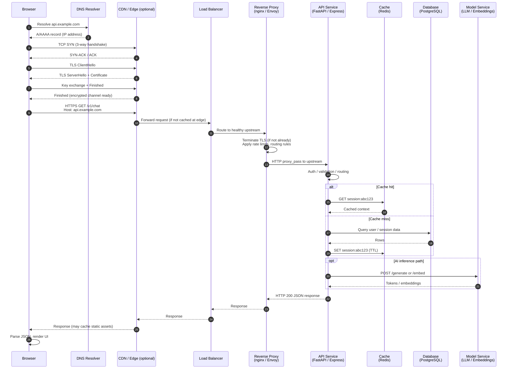
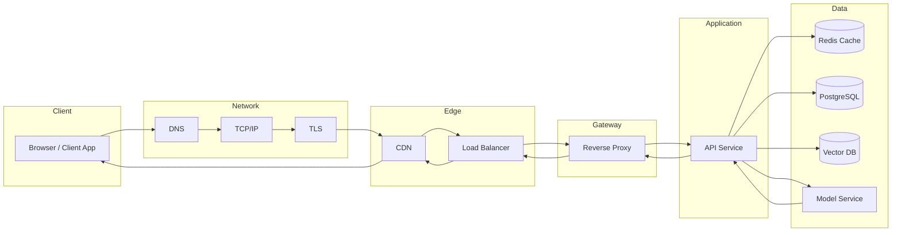

# Networking Request Lifecycle

End-to-end flow for a typical HTTPS request to an AI-enabled backend platform — from the browser through DNS, TLS, reverse proxy, API layer, and downstream data/model services.

This diagram supports Phase 1 deliverables for **Systems Engineering Foundations** and maps directly to the topics: HTTP, TCP/IP, DNS, TLS, reverse proxies, and load balancing.

---

## High-Level Flow

```text
browser request
  -> DNS resolution
  -> TLS handshake
  -> reverse proxy
  -> API service
  -> database / cache / model service
  -> response
```

---

## Detailed Lifecycle Diagram



---

## Layer-by-Layer Breakdown

### 1. DNS Resolution

Before any TCP connection, the client must resolve a hostname to an IP address.

| Step               | What happens                                     |
| ------------------ | ------------------------------------------------ |
| Browser cache      | Checks OS/browser DNS cache first                |
| OS resolver        | Queries configured resolver (`/etc/resolv.conf`) |
| Recursive resolver | ISP or public DNS (e.g., 8.8.8.8, 1.1.1.1)       |
| Authoritative DNS  | Returns A (IPv4) or AAAA (IPv6) record           |

```bash
dig api.example.com +trace
dig api.example.com A +short
```

**Failure modes:** NXDOMAIN (name doesn't exist), stale TTL, split-horizon DNS in internal environments.

---

### 2. TCP Three-Way Handshake

Establishes a reliable connection between client and server.

```text
Client                    Server
  |---- SYN -------------->|
  |<--- SYN-ACK ------------|
  |---- ACK -------------->|
  |     (connection open)  |
```

- **SYN** — client proposes initial sequence number
- **SYN-ACK** — server acknowledges and responds with its own sequence number
- **ACK** — client confirms; connection is established

Each hop (client → CDN → load balancer → proxy → app) may involve its own TCP connection. Proxies often maintain **connection pools** to upstream services to avoid repeated handshakes.

---

### 3. TLS Handshake (HTTPS)

TLS runs on top of TCP and provides encryption, integrity, and server authentication.

Typical TLS 1.3 flow (simplified):

```text
Client                              Server
  |---- ClientHello ---------------->|
  |<--- ServerHello + Certificate ---|
  |<--- EncryptedExtensions ----------|
  |---- Finished (encrypted) -------->|
  |<--- Finished (encrypted) ---------|
  |     Application data (HTTP)       |
```

Key concepts:

- **Certificate** — proves server identity (signed by CA)
- **SNI (Server Name Indication)** — tells the server which hostname the client wants (important behind shared IPs)
- **Termination point** — TLS may terminate at CDN, load balancer, or reverse proxy; traffic behind the proxy is often plain HTTP on a private network

```bash
curl -vI https://api.example.com
openssl s_client -connect api.example.com:443 -servername api.example.com
```

---

### 4. HTTP Request

Once TLS is established, the client sends an HTTP request.

```http
GET /v1/chat HTTP/1.1
Host: api.example.com
Authorization: Bearer <token>
Accept: application/json
Content-Type: application/json

{"prompt": "Explain vector databases"}
```

Important headers for backend/AI platforms:

| Header          | Role                                  |
| --------------- | ------------------------------------- |
| `Host`          | Virtual host routing at reverse proxy |
| `Authorization` | Identity / API key validation         |
| `X-Request-ID`  | Distributed tracing correlation       |
| `Content-Type`  | Request body format                   |
| `Accept`        | Expected response format              |

---

### 5. Reverse Proxy

A reverse proxy sits in front of application servers and handles cross-cutting concerns.

Common responsibilities:

- TLS termination
- Request routing (`/api` → API service, `/static` → object storage)
- Rate limiting and WAF rules
- Gzip/Brotli compression
- Connection keep-alive and upstream pooling
- Health-check-aware upstream selection

```nginx
# Simplified nginx upstream routing
upstream api_backend {
    server api-1:8080;
    server api-2:8080;
}

server {
    listen 443 ssl;
    server_name api.example.com;

    location /v1/ {
        proxy_pass http://api_backend;
        proxy_set_header X-Request-ID $request_id;
        proxy_set_header Host $host;
    }
}
```

---

### 6. Load Balancer

Distributes traffic across multiple healthy instances.

| Algorithm         | Behavior                                                     |
| ----------------- | ------------------------------------------------------------ |
| Round robin       | Rotate through backends evenly                               |
| Least connections | Send to instance with fewest active connections              |
| Weighted          | Favor higher-capacity nodes                                  |
| Consistent hash   | Sticky routing by client/key (useful for stateful workloads) |

Health checks remove unhealthy nodes from rotation. For AI workloads, also consider **GPU availability** and **queue depth** as routing signals.

---

### 7. API Service

The application layer validates, authorizes, and orchestrates work.

Typical steps:

1. Parse and validate request body
2. Authenticate caller (JWT, API key, mTLS)
3. Apply business logic and rate limits
4. Read/write session or user state
5. Call downstream services (cache, DB, model server)
6. Return structured response with appropriate status code

For streaming LLM responses, the API may switch to **chunked transfer encoding** or **Server-Sent Events (SSE)** instead of a single JSON payload.

---

### 8. Downstream Services

| Service                    | Role in AI platforms                               | Example                                       |
| -------------------------- | -------------------------------------------------- | --------------------------------------------- |
| **Cache (Redis)**          | Session state, rate-limit counters, hot embeddings | `GET embedding:doc-123`                       |
| **Database (PostgreSQL)**  | Users, conversations, metadata, job records        | `SELECT * FROM messages WHERE thread_id = $1` |
| **Vector DB**              | Similarity search for RAG                          | Pinecone, pgvector, Qdrant                    |
| **Model service**          | Inference — text generation, embeddings, reranking | vLLM, Ollama, Triton                          |
| **Queue (Redis/RabbitMQ)** | Async jobs — indexing, batch inference             | Worker consumes `embed-document` jobs         |

The API often fans out to multiple services in parallel:

```text
API request
  ├─> Cache (session lookup)
  ├─> DB (user permissions)
  ├─> Vector DB (retrieval)
  └─> Model service (generation)
        └─> Response assembled and returned
```

---

### 9. Response Path

The response travels back through the same infrastructure layers (in reverse):

```text
Model/DB/Cache
  -> API service (assemble JSON or stream tokens)
  -> Reverse proxy (add headers, compress)
  -> Load balancer
  -> CDN (cache if applicable)
  -> Browser (parse, render, or stream)
```

Response headers to know:

| Header                           | Meaning                    |
| -------------------------------- | -------------------------- |
| `Status: 200` / `4xx` / `5xx`    | Outcome                    |
| `Content-Type: application/json` | Body format                |
| `Transfer-Encoding: chunked`     | Streaming body             |
| `Cache-Control`                  | CDN/browser caching policy |
| `X-Request-ID`                   | Trace correlation ID       |

---

## Architecture Overview (Component View)



---

## Timing Breakdown (What to Measure)

Use these phases when debugging latency:

| Phase                     | Typical tool                    | What it tells you                 |
| ------------------------- | ------------------------------- | --------------------------------- |
| DNS lookup                | `curl -w %{time_namelookup}`    | Resolver or TTL issues            |
| TCP connect               | `curl -w %{time_connect}`       | Network path or firewall          |
| TLS handshake             | `curl -w %{time_appconnect}`    | Certificate or cipher overhead    |
| Time to first byte (TTFB) | `curl -w %{time_starttransfer}` | Backend processing time           |
| Total time                | `curl -w %{time_total}`         | End-to-end user-perceived latency |

```bash
curl -o /dev/null -s -w "\
dns_lookup:  %{time_namelookup}s\n\
tcp_connect:  %{time_connect}s\n\
tls_handshake: %{time_appconnect}s\n\
ttfb:         %{time_starttransfer}s\n\
total:        %{time_total}s\n" \
  https://api.example.com/v1/health
```

For LLM endpoints, TTFB often dominates because token generation is sequential. Separate **retrieval latency** (vector DB + embedding) from **generation latency** (model inference) in your observability stack.

---

## Common Failure Points

| Symptom                  | Likely layer             | Investigation                                 |
| ------------------------ | ------------------------ | --------------------------------------------- |
| "Could not resolve host" | DNS                      | `dig`, check `/etc/resolv.conf`               |
| Connection timeout       | TCP / firewall           | `nc -zv`, security groups, `ss -tulpn`        |
| Certificate error        | TLS                      | `openssl s_client`, cert expiry, SNI mismatch |
| 502 Bad Gateway          | Reverse proxy → upstream | Proxy error logs, upstream health             |
| 503 Service Unavailable  | Load balancer            | Health checks, capacity, all backends down    |
| 504 Gateway Timeout      | Proxy or slow backend    | Upstream timeout settings, DB/model latency   |
| Slow first token         | Model service            | GPU memory, batch size, queue depth           |
| Stale responses          | Cache                    | TTL settings, cache invalidation strategy     |

---

## Related Resources

- [Linux Command Reference](../linux-command-reference.md) — `curl`, `dig`, `ss`, and troubleshooting commands
- [Distributed Systems Notes](../distributed-systems-notes.md) — replication, partitioning, consistency, and fault tolerance
- Phase 1 topics: HTTP, TCP/IP, DNS, TLS, reverse proxies, load balancing
