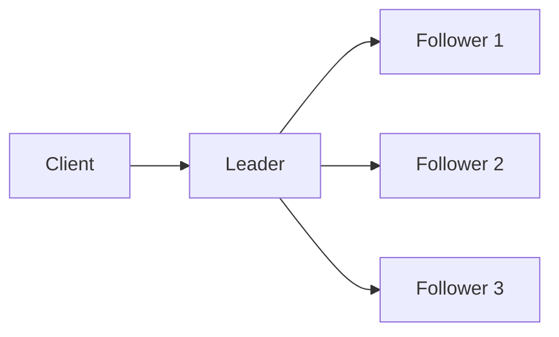
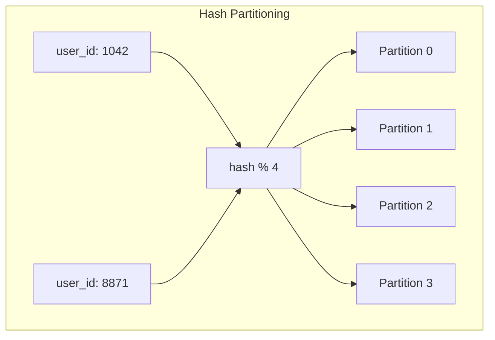
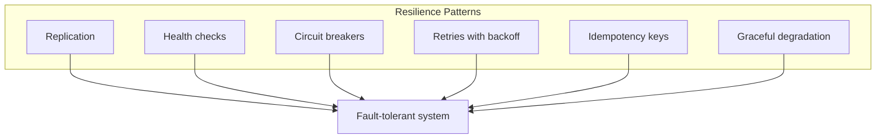
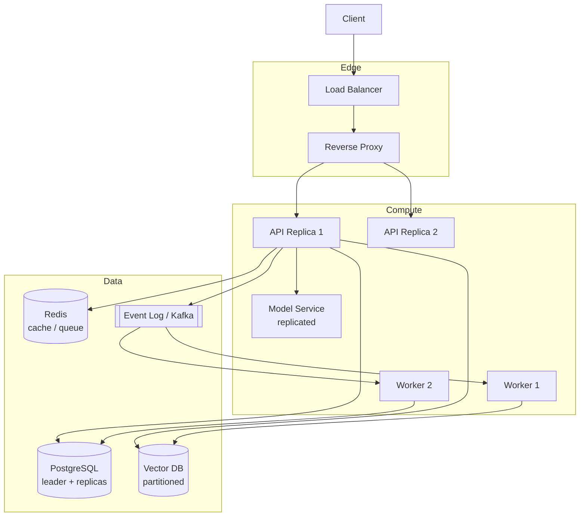

# Distributed Systems Notes

Foundational notes for Phase 1 — **Systems Engineering Foundations**. These concepts explain how backend and AI platforms stay reliable when work is spread across multiple machines, services, and failure domains.

Topics covered here map directly to the project roadmap:

- Distributed logs
- Replication and partitioning
- Consistency and fault tolerance

---

## Why Distributed Systems Matter for AI Infrastructure

A single-server application is simple: one process, one database, one disk. Production AI platforms rarely look like that.

Typical production stacks involve:

- Multiple API replicas behind a load balancer
- Separate worker pools for async jobs (embedding, indexing, batch inference)
- Replicated databases and caches
- Vector stores partitioned by tenant or collection
- Model servers scaled independently from the API tier
- Observability pipelines aggregating logs, metrics, and traces from every node

Once components run on different machines, you inherit classic distributed systems problems: **partial failures**, **network delays**, **clock skew**, **concurrent updates**, and **trade-offs between consistency and availability**.

The goal is not to eliminate failure — it is to **design systems that continue operating correctly (or degrade gracefully) when parts fail**.

---

## Core Concepts

### Single Node vs. Distributed System

| Aspect        | Single node                                  | Distributed system                |
| ------------- | -------------------------------------------- | --------------------------------- |
| Failure model | Process crash or machine down = total outage | Partial failure is normal         |
| State         | One source of truth                          | State replicated or partitioned   |
| Scaling       | Vertical (bigger machine)                    | Horizontal (more machines)        |
| Coordination  | Implicit (shared memory)                     | Explicit (RPC, queues, consensus) |
| Debugging     | Stack trace in one place                     | Correlation IDs across services   |

### Fallacies of Distributed Computing

Assumptions that break in production:

1. The network is reliable
2. Latency is zero
3. Bandwidth is infinite
4. The network is secure
5. Topology doesn't change
6. There is one administrator
7. Transport cost is zero
8. The network is homogeneous

In AI platforms, these show up as: model server timeouts, stale cache reads, cross-AZ latency spikes, and queue backlogs during GPU node restarts.

---

## Distributed Logs

A **log** is an append-only, ordered sequence of records. In distributed systems, logs become the backbone for replication, recovery, and event-driven architectures.

### Properties of a Good Distributed Log

| Property            | Meaning                                                         |
| ------------------- | --------------------------------------------------------------- |
| **Append-only**     | Records are never updated in place; corrections are new entries |
| **Ordered**         | Each record has a position (offset/sequence number)             |
| **Durable**         | Committed records survive process or node failure               |
| **Replicated**      | Copies exist on multiple nodes for fault tolerance              |
| **Consumer groups** | Multiple consumers can read at different offsets                |

### How Logs Enable Replication

Instead of copying entire database pages, systems replicate **log entries** — the ordered history of writes.

```text
Primary                          Replica
  |                                 |
  |-- write: INSERT user_id=42 ---->| apply same entry
  |-- write: UPDATE balance -------->| apply same entry
  |-- write: DELETE session -------->| apply same entry
```

If a replica falls behind, it catches up by reading log entries it missed. If the primary fails, a replica that has applied the same log can be promoted.

### Leader-Based Replication

Most replicated systems use a **leader (primary)** and one or more **followers (replicas)**:



1. Client sends writes to the leader
2. Leader appends to its log and replicates to followers
3. Followers apply entries in order
4. Reads may go to leader (strong consistency) or followers (eventual consistency)

**Examples:** PostgreSQL streaming replication, MySQL binlog replication, Redis Sentinel, Kafka partitions.

### Log-Based Messaging (Event Streaming)

Message brokers like **Kafka**, **Redpanda**, and **Pulsar** treat the log as the core abstraction:

```text
Producer -> [ partition log: offset 0, 1, 2, 3... ] -> Consumer(s)
```

Use cases in AI infrastructure:

| Use case                    | What gets logged                                            |
| --------------------------- | ----------------------------------------------------------- |
| Document ingestion pipeline | `document.uploaded`, `chunk.created`, `embedding.completed` |
| Async inference jobs        | Job submitted → queued → running → completed/failed         |
| Audit trail                 | Prompt, model version, token count, user ID                 |
| CDC (Change Data Capture)   | Database row changes streamed to search/vector index        |

### Write-Ahead Log (WAL)

Databases use a local WAL before applying changes to data files. On crash recovery, the system replays the WAL to restore committed state.

This same pattern appears at every layer:

- PostgreSQL WAL
- Kafka commit log segments
- etcd Raft log
- Vector DB segment files

**Key insight:** If you understand append-only logs, you understand a large fraction of how distributed databases and queues actually work.

---

## Replication and Partitioning

Scaling and reliability require two complementary strategies:

- **Replication** — copy the same data to multiple nodes (redundancy, read scaling)
- **Partitioning (sharding)** — split data across nodes (write scaling, size limits)

### Replication Strategies

| Strategy                | Description                                  | Pros                                     | Cons                                      |
| ----------------------- | -------------------------------------------- | ---------------------------------------- | ----------------------------------------- |
| **Single-leader**       | One node accepts writes; replicas follow     | Simple, strong consistency options       | Leader is bottleneck; failover complexity |
| **Multi-leader**        | Multiple nodes accept writes                 | Better write availability across regions | Conflict resolution required              |
| **Leaderless (quorum)** | Client writes to N nodes; reads from M nodes | High availability                        | Complex consistency; stale reads possible |

#### Synchronous vs. Asynchronous Replication

| Mode             | Behavior                                             | Trade-off                                      |
| ---------------- | ---------------------------------------------------- | ---------------------------------------------- |
| **Synchronous**  | Leader waits for replica ack before confirming write | Stronger durability; higher write latency      |
| **Asynchronous** | Leader confirms before replicas catch up             | Lower latency; risk of lost writes on failover |

For AI workloads:

- **User/session metadata** — often sync or semi-sync (PostgreSQL)
- **Embedding job status** — async is acceptable with idempotent workers
- **Model artifact storage** — replicate objects across regions (S3 cross-region replication)

### Partitioning Strategies

When one node cannot hold all data or handle all traffic, partition it.

| Strategy                       | How keys map to partitions                   | Best for                        |
| ------------------------------ | -------------------------------------------- | ------------------------------- |
| **Key range**                  | Keys A–M → partition 1, N–Z → partition 2    | Range queries, time-series      |
| **Hash of key**                | `hash(user_id) % N`                          | Even distribution               |
| **Consistent hashing**         | Minimal reshuffling when nodes added/removed | Dynamic clusters (caches, DHTs) |
| **Directory / lookup service** | External map of key → partition              | Flexible rebalancing            |



#### Partitioning in AI Platforms

| Component         | Typical partition key          | Why                                   |
| ----------------- | ------------------------------ | ------------------------------------- |
| Vector database   | `tenant_id` or `collection_id` | Isolate customer data; scale search   |
| Kafka topics      | `document_id` or `user_id`     | Preserve ordering per entity          |
| LLM request queue | `priority` or `model_name`     | Route to specialized worker pools     |
| Object storage    | Prefix per tenant/date         | Lifecycle policies and access control |

### Replication + Partitioning Together

Large systems combine both. **Kafka** is the canonical example:

```text
Topic: document-events
  Partition 0 (leader on broker-1, replicas on broker-2, broker-3)
  Partition 1 (leader on broker-2, replicas on broker-1, broker-3)
  Partition 2 (leader on broker-3, replicas on broker-1, broker-2)
```

Each partition is an ordered log. Replication provides fault tolerance within a partition. Partitioning provides parallelism across the topic.

### Secondary Indexes in Partitioned Systems

A secondary index (e.g., search by email when partitioned by `user_id`) either:

1. **Co-locates** with the primary partition (local index)
2. **Maintains a separate index partition** (global index, often eventually consistent)

Vector DBs face a related problem: approximate nearest neighbor (ANN) indexes must be rebuilt or updated as vectors are inserted — partitioning affects recall and query fan-out.

---

## Consistency and Fault Tolerance

### Consistency Models

**Consistency** describes what a reader sees after a write — especially when replicas exist or caches sit in front of databases.

| Model                     | Guarantee                                 | Example                         |
| ------------------------- | ----------------------------------------- | ------------------------------- |
| **Strong / linearizable** | Reads reflect the latest completed write  | etcd, Spanner (with caveats)    |
| **Sequential**            | All nodes agree on operation order        | Single-leader replication       |
| **Causal**                | Causally related operations seen in order | Session tokens, vector clocks   |
| **Eventual**              | Replicas converge if no new writes        | DNS, CDN caches, async replicas |
| **Read-your-writes**      | User sees their own updates               | Session stickiness to primary   |
| **Monotonic reads**       | User never sees time go backward          | Route reads to same replica     |

For RAG pipelines, consistency choices affect whether a newly uploaded document is immediately searchable:

```text
Upload API -> Object store (durable)
          -> Queue job
          -> Worker embeds + upserts vector
          -> Index becomes searchable (eventual)
```

Strong consistency at every step would slow ingestion; eventual consistency is usually acceptable if the UI communicates indexing status.

### CAP Theorem (Simplified)

When a network partition occurs, a distributed system must choose:

- **Consistency** — all nodes return the same data
- **Availability** — every request gets a response (not an error)

You cannot have both during a partition. In practice, most systems are **AP** (available, eventually consistent) or **CP** (consistent, may reject requests) depending on the operation.

### PACELC Extension

**If Partition:** choose Availability or Consistency  
**Else (normal operation):** choose Latency or Consistency

This better matches real systems — even without partitions, you trade consistency for speed (e.g., reading from a Redis cache instead of PostgreSQL).

| System                    | Typical bias                   | AI platform usage      |
| ------------------------- | ------------------------------ | ---------------------- |
| PostgreSQL (sync replica) | PC/EC                          | User accounts, billing |
| Redis cache               | PA/EL                          | Session, rate limits   |
| Vector DB (replicated)    | PA/EL                          | Similarity search      |
| Kafka                     | PA/EL (per partition ordering) | Event pipelines        |

### Quorum Reads and Writes

In leaderless systems (Dynamo-style), define:

- **W** — nodes that must acknowledge a write
- **R** — nodes contacted for a read
- **N** — total replicas

If **R + W > N**, overlapping nodes ensure you read a fresh value (assuming proper versioning).

Example: N=3, W=2, R=2 — tolerate one node failure while maintaining read-after-write consistency for that quorum configuration.

### Fault Tolerance Patterns

**Fault tolerance** means the system continues (or recovers) when components fail.

| Failure type          | Example                     | Mitigation                                          |
| --------------------- | --------------------------- | --------------------------------------------------- |
| Process crash         | API pod OOMKilled           | Health checks, restart policy, multiple replicas    |
| Machine failure       | GPU node dies mid-inference | Job timeout, retry on another worker, checkpointing |
| Network partition     | AZ link degraded            | Multi-AZ deployment, circuit breakers               |
| Slow node (straggler) | One replica lagging         | Read from leader; hedged requests                   |
| Cascading failure     | Retry storm overloads DB    | Backpressure, rate limits, bulkheads                |
| Data corruption       | Bad disk sector             | Replication, checksums, backups                     |



#### Idempotency

Retries are inevitable in distributed systems. An operation is **idempotent** if performing it multiple times has the same effect as performing it once.

```text
Non-idempotent:  charge_credit_card($10)   # retry may double-charge
Idempotent:      charge(idempotency_key=abc, $10)  # retry is safe
```

Apply idempotency to: webhook handlers, embedding jobs, index upserts, and payment-adjacent API calls.

#### Timeouts, Retries, and Backoff

| Setting     | Risk if too low                     | Risk if too high                        |
| ----------- | ----------------------------------- | --------------------------------------- |
| Timeout     | False failures, unnecessary retries | Slow user experience, thread exhaustion |
| Max retries | Gives up too early                  | Amplifies load during outages           |
| Backoff     | Retries collide (thundering herd)   | Slow recovery                           |

Exponential backoff with jitter is the standard pattern:

```text
wait = min(cap, base * 2^attempt) + random_jitter
```

#### Circuit Breakers

When a downstream service (model server, vector DB) fails repeatedly, stop calling it temporarily and fail fast or serve a fallback. Prevents a sick dependency from taking down the entire API tier.

States: **Closed** (normal) → **Open** (reject calls) → **Half-open** (probe with test requests)

### Distributed Transactions vs. Sagas

**Two-phase commit (2PC)** coordinates a transaction across nodes but blocks on failures and doesn't scale well across services.

**Saga** — a sequence of local transactions with compensating actions:

```text
RAG document ingestion saga:
  1. Store raw file in object storage
  2. Insert metadata row (status: processing)
  3. Queue embedding job
  4. Worker embeds chunks -> upsert vectors
  5. Update metadata (status: indexed)

Failure at step 4 -> retry job (idempotent upsert)
Failure after partial upsert -> mark failed, allow re-index
```

Event-driven architectures implement sagas naturally via logs and consumer idempotency.

---

## Observability in Distributed Systems

Debugging a single log file is easy. Debugging a failed LLM request across six services is not.

### The Three Pillars

| Pillar      | Question it answers               | AI platform examples                        |
| ----------- | --------------------------------- | ------------------------------------------- |
| **Logs**    | What happened?                    | Prompt logged, model error, retrieval miss  |
| **Metrics** | How much / how fast?              | Tokens/sec, queue depth, GPU utilization    |
| **Traces**  | Which path did this request take? | API → retriever → embedder → LLM → response |

### Correlation IDs

Every inbound request gets a unique ID (e.g., `X-Request-ID`) propagated to all downstream calls. This ties together log lines and trace spans across services.

```text
req-8f3a2b
  ├─ api-gateway       (span: 12ms)
  ├─ auth-service      (span: 4ms)
  ├─ rag-retriever     (span: 89ms)
  │    └─ vector-db    (span: 76ms)
  └─ llm-service       (span: 1240ms)
```

See [Networking Request Lifecycle Diagram](./diagrams/networking-request-lifecycle.md) for where tracing fits in the request path.

---

## AI Platform Architecture (Distributed View)

How Phase 1 concepts compose in a typical observable LLM platform:



| Component     | Replication                 | Partitioning              | Consistency                | Fault tolerance                |
| ------------- | --------------------------- | ------------------------- | -------------------------- | ------------------------------ |
| API tier      | Multiple stateless replicas | N/A (stateless)           | N/A                        | LB health checks, auto-restart |
| PostgreSQL    | Streaming replication       | Optional sharding (Citus) | Strong on leader           | Failover, backups              |
| Redis         | Sentinel/Cluster            | Hash slots                | Eventual                   | Replica promotion              |
| Vector DB     | Replica shards              | By collection/tenant      | Eventual for index updates | Rebalance, retry upserts       |
| Kafka         | Per-partition replicas      | Topics/partitions         | Ordered per partition      | ISR, consumer offsets          |
| Model service | Multiple GPU workers        | By model/route            | N/A                        | Queue + timeout + retry        |

---

## Design Checklist

When designing or reviewing a distributed component in this learning lab, ask:

### Data

- [ ] What is the source of truth?
- [ ] Is data replicated? Sync or async?
- [ ] How is data partitioned? What happens when we add nodes?
- [ ] What consistency does the user experience require?

### Failure

- [ ] What happens if this node dies mid-request?
- [ ] Are retries safe (idempotent)?
- [ ] Is there a timeout and circuit breaker on downstream calls?
- [ ] Can the system degrade gracefully (cached answer, queue for later)?

### Operations

- [ ] Can I trace one request across all services?
- [ ] Are logs structured with correlation IDs?
- [ ] What metrics indicate replication lag, queue depth, or partition imbalance?
- [ ] Have I tested failover — not just read about it?

---

## Common Anti-Patterns

| Anti-pattern                         | Problem                         | Better approach                          |
| ------------------------------------ | ------------------------------- | ---------------------------------------- |
| Shared mutable state across services | Race conditions, tight coupling | Database or queue as coordination point  |
| Unbounded retries                    | Cascading overload              | Backoff, max attempts, circuit breakers  |
| Missing idempotency                  | Duplicate side effects          | Idempotency keys, dedup tables           |
| Single replica in production         | No fault tolerance              | Minimum 2 replicas + health checks       |
| Ignoring replication lag             | Stale reads after write         | Read-your-writes routing, version checks |
| God service                          | One deployable owns everything  | Separate API, workers, model tier        |
| Sync call chain to LLM               | Latency multiplies              | Async jobs, streaming, caching           |

---

## Glossary

| Term                     | Definition                                               |
| ------------------------ | -------------------------------------------------------- |
| **Availability**         | System remains operational and responds to requests      |
| **Consensus**            | Nodes agree on a value (Raft, Paxos)                     |
| **Eventual consistency** | Replicas converge over time without new writes           |
| **Failover**             | Promoting a standby when the primary fails               |
| **Idempotency**          | Safe to retry without duplicate effects                  |
| **ISR**                  | In-Sync Replicas — Kafka followers caught up with leader |
| **Partition (network)**  | Nodes cannot communicate despite being up                |
| **Partition (data)**     | Shard — subset of data on one node                       |
| **Quorum**               | Minimum nodes needed to agree on read/write              |
| **Replication lag**      | Delay between leader write and replica apply             |
| **Shard**                | Same as data partition                                   |
| **Split brain**          | Two nodes both believe they are the leader               |
| **Straggler**            | Slow node delaying overall completion                    |

---

## Further Reading

- _Designing Data-Intensive Applications_ — Martin Kleppmann (primary reference for this learning lab)
- _Distributed Systems_ — Tanenbaum & Van Steen
- Kafka documentation — log-based messaging and consumer groups
- PostgreSQL docs — streaming replication and WAL
- OpenTelemetry — tracing across distributed services

---

## Related Deliverables

- [Linux Command Reference](./linux-command-reference.md) — process, network, and troubleshooting commands
- [Networking Request Lifecycle Diagram](./diagrams/networking-request-lifecycle.md) — request path through load balancers, proxies, and services
- [DDIA Architecture Breakdowns](./ddia-architecture-breakdowns.md) — chapter tradeoffs, patterns, and AI platform connections
