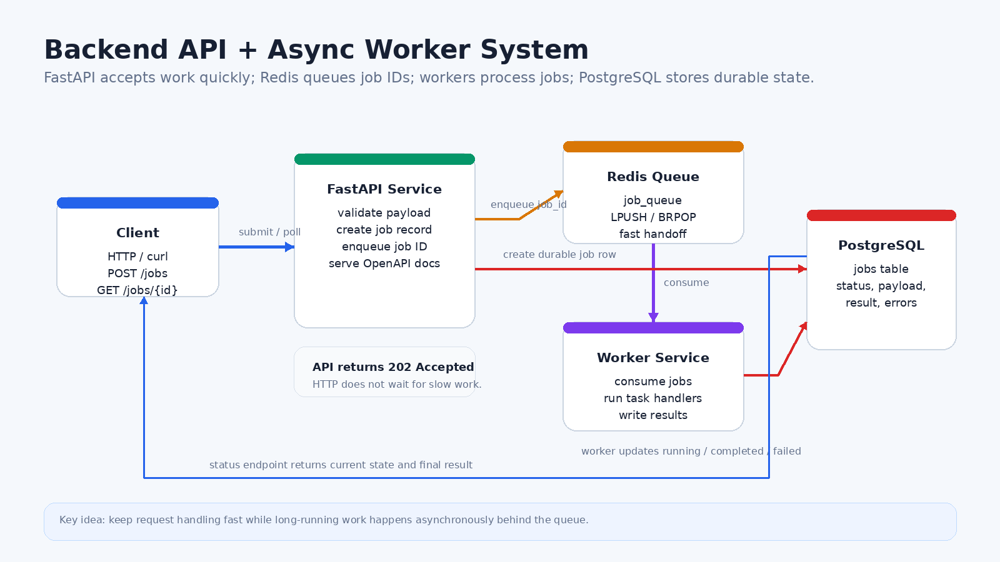
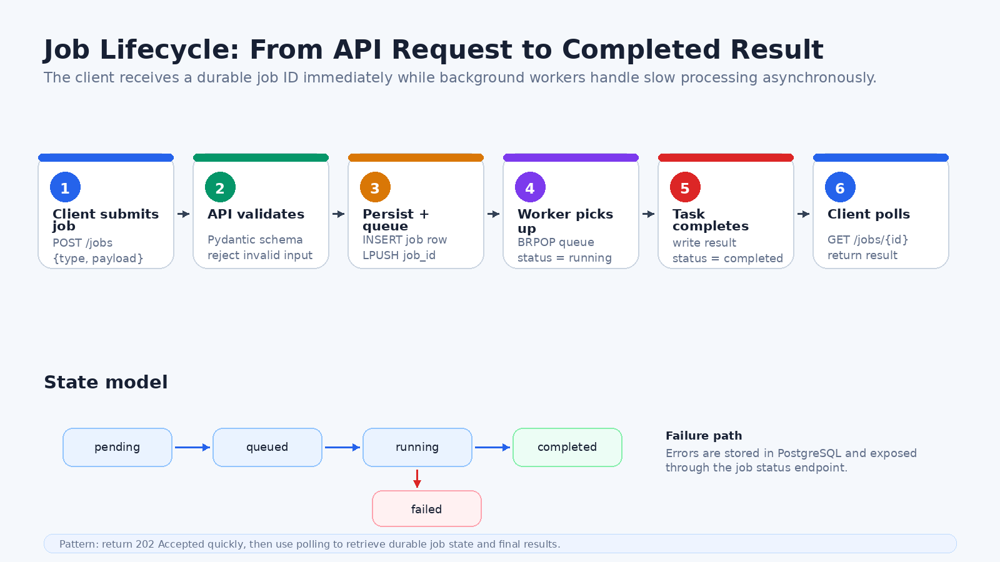

# Building a Production-Style Backend API with Async Workers

A practical FastAPI, Redis, PostgreSQL, and Docker Compose project for reliable background job processing.

## Why This Project Exists

Modern AI and data applications rarely fit into a simple request-response pattern. Some work is quick: validating an API request, writing metadata, checking health, or returning a status. Other work is slow: processing documents, generating embeddings, calling a model, running evaluations, transforming files, or waiting on external systems.

This project, `02-backend-api-worker`, is a hands-on implementation of a backend pattern that separates those two worlds. The API accepts work quickly, stores a durable job record, places the job on a queue, and lets a worker process it in the background. The client can poll for job status and retrieve the result when the work is done.

The goal is not just to build a toy API. The goal is to practice the shape of a production backend system: clear service boundaries, durable state, queue-based decoupling, health checks, structured logs, Dockerized local development, and API documentation.

## The System at a Glance

The project has four main runtime components:

- **FastAPI API service:** validates requests, creates jobs, enqueues work, and exposes status endpoints.
- **Redis queue:** stores job IDs so workers can pull work asynchronously.
- **Worker service:** consumes queued jobs, runs task handlers, and writes results back to the database.
- **PostgreSQL database:** acts as the source of truth for job status, payloads, results, errors, and timestamps.

This design gives the API a small, predictable responsibility: accept and track work. It also lets background processing evolve separately. In later AI infrastructure phases, the simple task handlers can become embedding jobs, document indexing, model inference, batch evaluations, or other long-running workflows.

## How a Job Moves Through the System

The lifecycle starts with a client sending `POST /jobs` and a payload. The API validates the request with Pydantic models, inserts a job row into PostgreSQL, pushes the job ID into Redis, and returns `202 Accepted`. From the client perspective, the request finishes quickly because the expensive work has not happened yet.

The worker blocks on Redis using a queue-consumer loop. When a job ID appears, the worker loads the job from PostgreSQL, marks it as `running`, executes the correct task handler, then writes either a `completed` result or a `failed` error message back to PostgreSQL.

The client can call `GET /jobs/{job_id}` until the job reaches a terminal state. This status-polling pattern is simple, easy to reason about, and reliable enough for many backend and AI platform workflows.

## What the API Supports

The project includes a small set of task types that prove out the infrastructure pattern:

| Job Type | Purpose | Example Result |
| --- | --- | --- |
| `word_count` | Count words and characters | `word_count`, `character_count` |
| `reverse_text` | Reverse a string | `original`, `reversed` |
| `slow_task` | Simulate long-running work | `message`, `slept_seconds` |

The endpoints are intentionally focused:

- `GET /health` checks PostgreSQL and Redis connectivity.
- `POST /jobs` creates and queues a background job.
- `GET /jobs/{job_id}` returns one job's status and result.
- `GET /jobs` lists recent jobs.
- `/docs` and `/redoc` expose generated API documentation.

## Why Redis and PostgreSQL Work Well Together

Redis is used as the queue, not as the system of record. That distinction matters. Redis is excellent for fast queue operations like `LPUSH` and `BRPOP`, while PostgreSQL is better suited for durable job history, structured querying, timestamps, and result storage.

The queue carries only the job ID. The database stores the complete job record. This keeps the queue lightweight and makes the job lifecycle auditable.

## Why Separate the API and Worker

Separating the API from the worker creates several benefits:

- **Independent scaling:** add more API replicas for request volume or more workers for processing volume.
- **Failure isolation:** an API restart does not erase job records, and a worker crash does not remove the API surface.
- **Clear ownership:** the API handles validation and orchestration; the worker handles execution.
- **Production alignment:** this mirrors how real systems handle long-running background work.

That separation becomes even more important for AI systems. Embedding generation, vector indexing, model calls, and evaluation runs can all take longer than a normal HTTP request should remain open.

## Reliability Features Built In

This project includes several reliability practices that are easy to overlook in early backend projects:

- health checks for API, PostgreSQL, Redis, and worker dependencies
- explicit job states: `pending`, `queued`, `running`, `completed`, `failed`
- request payload validation before work is queued
- durable job state in PostgreSQL
- structured JSON logs with fields like `job_id`, `job_type`, and `service`
- Docker Compose networking and dependency health conditions

It also documents future production improvements: retries, dead-letter queues, job timeouts, idempotency keys, authentication, and richer observability.

## What This Teaches

The most important lesson is architectural: asynchronous backend systems are about managing time and failure. Instead of forcing a client to wait while slow work happens, the system gives the client a durable handle to the work and processes it in the background.

This pattern shows up everywhere in production AI infrastructure:

- document ingestion
- embedding jobs
- vector database indexing
- batch model inference
- evaluation pipelines
- report generation
- long-running workflow steps

By building the pattern with FastAPI, Redis, PostgreSQL, and Docker Compose, this project creates a foundation for more advanced AI platform systems.

## Final Takeaway

`02-backend-api-worker` is a compact but realistic backend architecture. It demonstrates how to accept work quickly, process it reliably, store state durably, and expose the right operational surfaces for local development and future production hardening.

For anyone learning AI infrastructure, this is a useful stepping stone: before scaling model serving, RAG systems, or Kubernetes deployments, it helps to understand how reliable backend job processing actually works.
