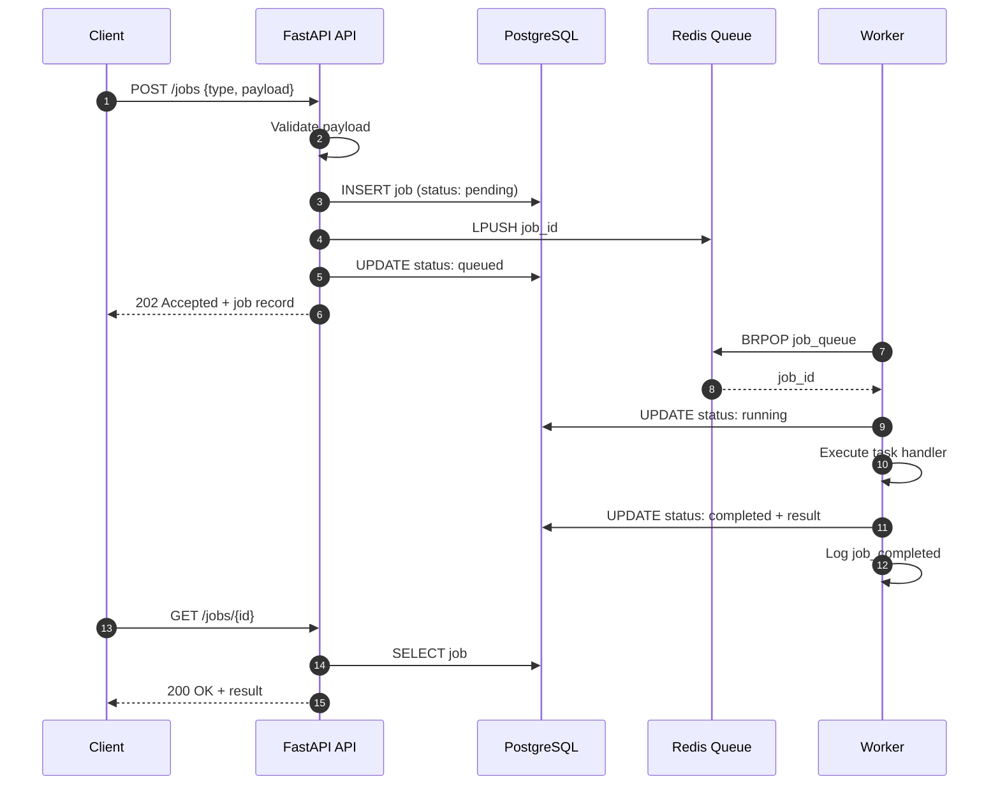

# Architecture — Backend API + Async Worker System

System design for Phase 2 of the AI Infrastructure Learning Lab: a production-style backend with async job processing.

---

## High-Level Architecture

```text
Client
  -> REST API (FastAPI)
      -> PostgreSQL (job records)
      -> Redis queue (job IDs)
          -> Worker service
              -> PostgreSQL (status + results)
```

---

## Component Diagram

```mermaid
flowchart TB
    subgraph Client
        C[HTTP Client / curl]
    end

    subgraph API["API Service (FastAPI)"]
        EP[REST Endpoints]
        VAL[Request Validation]
        LOG1[Structured Logging]
    end

    subgraph Queue["Message Queue"]
        RQ[(Redis List<br/>job_queue)]
    end

    subgraph Worker["Worker Service"]
        CON[Queue Consumer]
        TASK[Task Handlers]
        LOG2[Structured Logging]
    end

    subgraph Data["Persistent Storage"]
        PG[(PostgreSQL<br/>jobs table)]
    end

    C -->|POST /jobs| EP
    C -->|GET /jobs/{id}| EP
    EP --> VAL
    VAL --> PG
    EP -->|LPUSH job_id| RQ
    RQ -->|BRPOP| CON
    CON --> TASK
    TASK --> PG
    EP --> LOG1
    CON --> LOG2
```

---

## Request Lifecycle



---

## Service Responsibilities

| Component          | Role                                                        | Technology               |
| ------------------ | ----------------------------------------------------------- | ------------------------ |
| **API service**    | Accept jobs, validate input, persist metadata, enqueue work | FastAPI, Uvicorn         |
| **Worker service** | Consume queue, run tasks, update job state                  | Python, Redis BRPOP loop |
| **Redis**          | Durable in-memory queue of job IDs                          | Redis 7                  |
| **PostgreSQL**     | Source of truth for job state and results                   | PostgreSQL 16            |
| **Docker Compose** | Local orchestration, health checks, networking              | Compose v2               |

---

## Data Model

### `jobs` table

| Column         | Type      | Description                                           |
| -------------- | --------- | ----------------------------------------------------- |
| `id`           | UUID      | Primary key                                           |
| `type`         | enum      | `word_count`, `reverse_text`, `slow_task`             |
| `status`       | enum      | `pending`, `queued`, `running`, `completed`, `failed` |
| `payload`      | JSONB     | Validated task input                                  |
| `result`       | JSONB     | Task output (when completed)                          |
| `error`        | text      | Error message (when failed)                           |
| `created_at`   | timestamp | Job creation time                                     |
| `updated_at`   | timestamp | Last status change                                    |
| `started_at`   | timestamp | Worker start time                                     |
| `completed_at` | timestamp | Terminal state time                                   |

---

## Design Decisions

### Why Redis as a queue?

Redis provides a simple, fast list-based queue (`LPUSH` / `BRPOP`) ideal for learning async patterns before adopting RabbitMQ or Kafka in later phases.

### Why PostgreSQL for job state?

Job status must survive worker restarts. PostgreSQL is the durable source of truth; Redis only carries job IDs.

### Why separate API and worker containers?

Mirrors production architecture:

- Scale API and workers independently
- Deploy API without restarting workers
- Isolate failure domains (API crash does not stop in-flight worker jobs)

### Structured logging

Both services emit JSON logs via `structlog` with fields like `job_id`, `job_type`, and `service` — preparing for OpenTelemetry integration in Phase 5.

---

## Failure Handling

| Scenario                    | Behavior                                                                 |
| --------------------------- | ------------------------------------------------------------------------ |
| Invalid payload             | API returns 422; no job enqueued                                         |
| Redis unavailable on submit | Job marked `failed`; API returns 503                                     |
| Worker crash mid-job        | Job may remain `running`; restart worker to continue processing new jobs |
| Unknown job ID in queue     | Worker logs warning and skips                                            |
| Duplicate queue message     | Worker checks terminal status before reprocessing                        |

**Production improvements (future):** dead-letter queue, job timeouts, retry with backoff, idempotency keys.

---

## Health Checks

| Service    | Check                            |
| ---------- | -------------------------------- |
| PostgreSQL | `pg_isready`                     |
| Redis      | `redis-cli ping`                 |
| API        | `GET /health` (Postgres + Redis) |
| Worker     | Redis connectivity probe         |

Docker Compose uses these checks to control startup order.

---

## Scaling Path

```text
Current (local):
  1 API + 1 Worker + 1 Redis + 1 Postgres

Next steps:
  N API replicas behind load balancer
  M worker replicas consuming same queue
  Postgres read replicas for status polling
  Redis Cluster or RabbitMQ for higher throughput
```

This pattern maps directly to async AI workloads: embedding jobs, document indexing, batch inference, and eval runs.

---

## Related Documentation

- [API Documentation](../docs/API.md)
- [Local Setup README](../README.md)
- [Phase 1 — Distributed Systems Notes](../01-systems-foundations/distributed-systems-notes.md)
