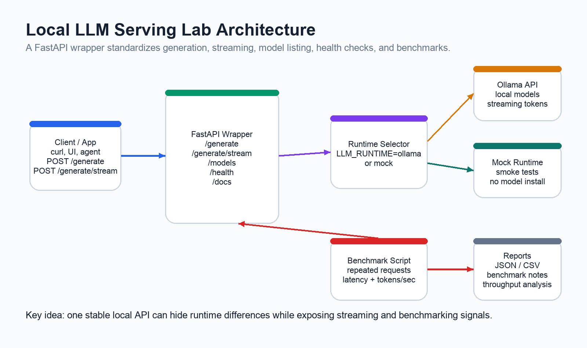
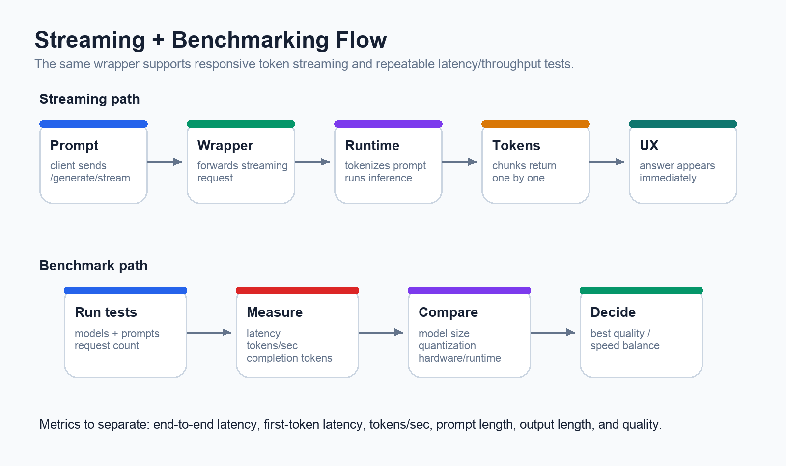

# Building a Local LLM Serving Lab

A practical FastAPI, Ollama, streaming, and benchmarking project for understanding how local language model inference actually works.

## Why This Project Exists

Local LLM tooling has become surprisingly accessible. With tools like Ollama, llama.cpp, and small instruction-tuned models, a developer can run useful language models on a laptop. But running a model is only the first step. To understand model serving as infrastructure, it helps to wrap the model behind an API, stream responses, compare runtimes, and measure latency and throughput.

The `03-local-llm-serving-lab` project is a hands-on lab for that exact goal. It turns local inference into a small service with a clean API surface, a runtime abstraction, streaming support, benchmark tooling, and written notes for comparing model-serving options.

The project is intentionally local-first. It can run against Ollama for real local inference, or it can use a built-in mock runtime so the API and benchmark path can be tested before installing any model runtime.

## The System at a Glance

The lab is centered on a FastAPI wrapper that sits between clients and local model runtimes.

- **Client or app:** sends prompts to the API and receives either full responses or streamed chunks.
- **FastAPI wrapper:** exposes `/generate`, `/generate/stream`, `/models`, `/health`, and interactive docs.
- **Runtime client:** selects the local inference backend, with support for Ollama and a mock runtime.
- **Local model runtime:** runs the actual model, handles tokenization, and produces output tokens.
- **Benchmark script:** sends repeated requests, records latency and throughput, and writes JSON/CSV outputs.

This shape is useful because it separates application concerns from runtime concerns. A client does not need to know whether the response comes from Ollama, llama.cpp, a GPU-backed service, or a mock runtime. It calls one API contract.

## What the API Provides

The API keeps the surface area small and focused:

| Endpoint | Purpose |
| --- | --- |
| `GET /health` | Check wrapper and runtime status |
| `GET /models` | List available local models |
| `POST /generate` | Return a complete generated response |
| `POST /generate/stream` | Stream generated text chunks as they arrive |
| `GET /docs` | Explore the OpenAPI documentation |

A typical generation request includes a prompt, model name, temperature, and max token limit. The non-streaming response reports model name, runtime, response text, latency, tokens per second, and token usage when the runtime exposes those counters.

## Why Streaming Matters

Streaming is one of the most important user experience patterns in LLM applications. Even when total generation time stays the same, streaming makes the system feel faster because users see the answer begin immediately.

In this lab, `POST /generate/stream` forwards chunks from the runtime to the client as plain text. The flow looks like this:

1. The client sends a prompt to the FastAPI wrapper.
2. The wrapper forwards a streaming request to the runtime.
3. The local model tokenizes the prompt and starts inference.
4. Each generated token or chunk is sent back through the API.
5. The client receives an incremental response instead of waiting for the full answer.

This is the foundation for chat interfaces, coding assistants, local agents, and developer tools that need a responsive feel.

## What the Benchmark Script Measures

The benchmark script sends repeated requests to the local API and records the results. It writes JSON and CSV files to `benchmark-runs/`, keeping local experiments separate from committed source files.

The key metrics are:

| Metric | What It Tells You |
| --- | --- |
| Average latency | Typical end-to-end request time |
| P50 latency | Median request latency |
| Max latency | Slowest request in the benchmark set |
| Tokens per second | Completion throughput reported by the runtime |
| Completion tokens | Number of generated tokens |
| Response characters | Rough sanity check for output size |

The point is not to crown one model as universally best. The point is to understand tradeoffs. A small model may be fast enough for local workflows. A larger model may produce better answers but require more memory and deliver fewer tokens per second. Quantization can reduce memory use and improve speed, but it may affect output quality.

## Runtime Tradeoffs

The project documents four runtime paths:

| Runtime | Best Use |
| --- | --- |
| Ollama | Fast local experimentation and simple model management |
| llama.cpp | Understanding quantization, GGUF models, and CPU/Apple Silicon inference |
| Hugging Face TGI | Production-style GPU serving and batching |
| vLLM | High-throughput serving concepts like PagedAttention |

Ollama is the default because it gives the shortest path to a working local API. llama.cpp is the best path for understanding the lower-level mechanics of local inference. TGI and vLLM represent the bridge from laptop experiments to production-grade model serving.

## The Engineering Lessons

This lab reinforces a few important infrastructure lessons:

- **Local model serving is still service design.** Even on a laptop, you need API contracts, health checks, runtime configuration, and error handling.
- **Latency has multiple meanings.** End-to-end latency, first-token latency, prompt evaluation time, and tokens per second answer different questions.
- **Streaming changes perceived performance.** Users often care about when output starts, not just when it finishes.
- **Quantization is a tradeoff.** Smaller models and lower precision can improve speed and memory use, but quality must be evaluated.
- **Benchmarking needs context.** Model size, prompt length, output length, hardware, and runtime all affect the numbers.

## Why This Matters for AI Infrastructure

A production AI platform is more than a model. It needs APIs, queues, retrieval systems, observability, performance testing, and deployment automation. But model serving remains one of the core pieces. This project creates a small, understandable model-serving layer that later phases can build on.

The same wrapper pattern can eventually connect to RAG systems, async workers, observability traces, load tests, and Kubernetes deployments. Starting locally makes the system easier to reason about before adding distributed infrastructure.

## Final Takeaway

`03-local-llm-serving-lab` turns local inference into an infrastructure learning exercise. It shows how to wrap a model runtime, stream responses, compare serving options, and measure performance in a repeatable way.

For anyone learning AI infrastructure, this is a useful step between simply running a model and designing a production model-serving platform.
