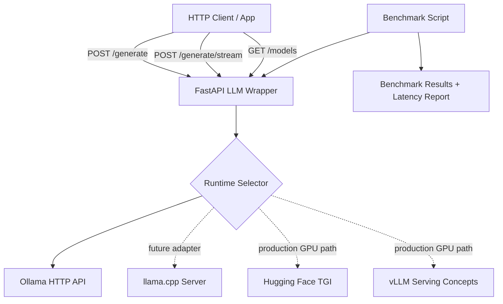
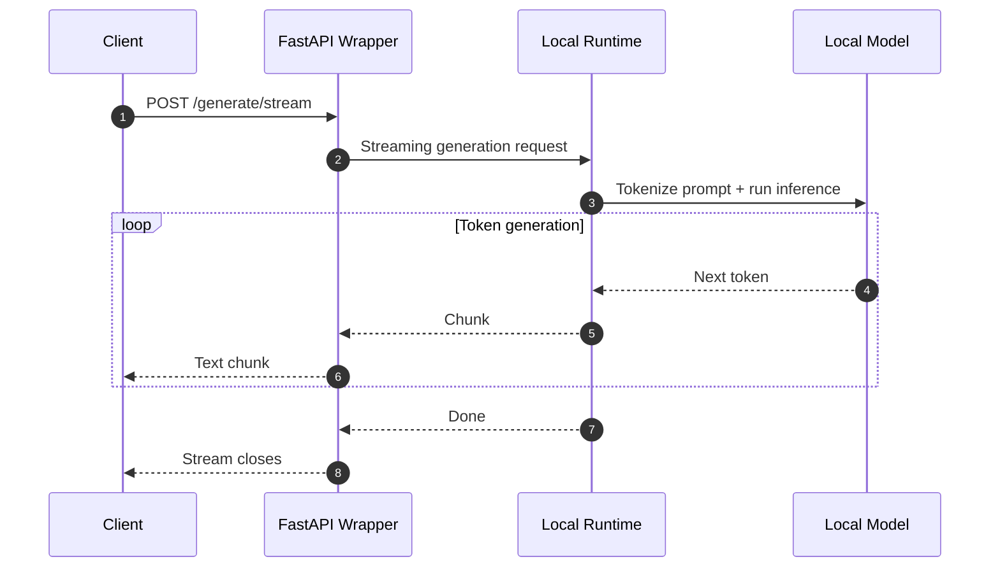

# Local LLM Serving Flow

## Component Diagram

```mermaid
flowchart TB
    Client[HTTP Client / App]
    API[FastAPI LLM Wrapper]
    Runtime{Runtime Selector}
    Ollama[Ollama HTTP API]
    LlamaCpp[llama.cpp Server]
    TGI[Hugging Face TGI]
    VLLM[vLLM Serving Concepts]
    Metrics[Benchmark Script]
    Reports[Benchmark Results + Latency Report]

    Client -->|POST /generate| API
    Client -->|POST /generate/stream| API
    Client -->|GET /models| API
    API --> Runtime
    Runtime --> Ollama
    Runtime -. future adapter .-> LlamaCpp
    Runtime -. production GPU path .-> TGI
    Runtime -. production GPU path .-> VLLM
    Metrics --> API
    Metrics --> Reports
```

## Streaming Sequence

```mermaid
sequenceDiagram
    autonumber
    participant Client
    participant API as FastAPI Wrapper
    participant Runtime as Local Runtime
    participant Model as Local Model

    Client->>API: POST /generate/stream
    API->>Runtime: Streaming generation request
    Runtime->>Model: Tokenize prompt + run inference
    loop Token generation
        Model-->>Runtime: Next token
        Runtime-->>API: Chunk
        API-->>Client: Text chunk
    end
    Runtime-->>API: Done
    API-->>Client: Stream closes
```
