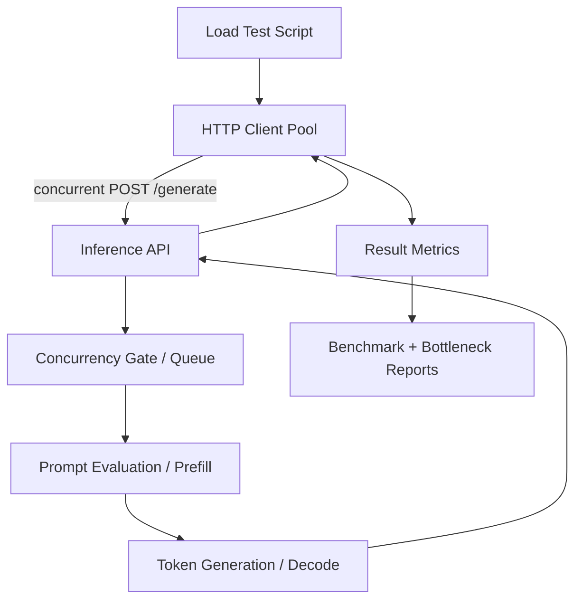
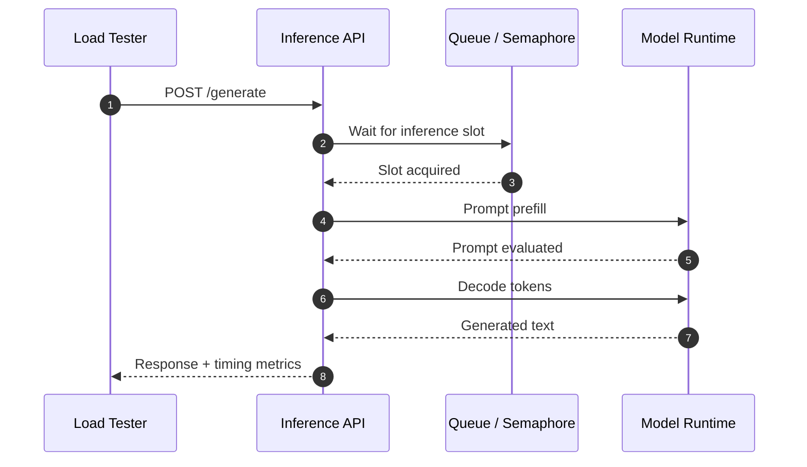

# Performance Architecture Diagram

Phase 6 deliverable for visualizing model-serving performance measurement.

## Component Diagram



## Timing Diagram



## Bottleneck Map

```text
High queue_wait_ms
  -> concurrency saturation
  -> add replicas, lower request size, tune batching

High prompt_eval_ms
  -> long context or slow prefill
  -> reduce chunks, compress context, tune prefill batch

High generation_ms
  -> decode-bound model runtime
  -> quantize, smaller model, GPU acceleration, batching

High estimated_vram_mb
  -> KV cache pressure
  -> lower context, lower concurrency, use paged attention
```
