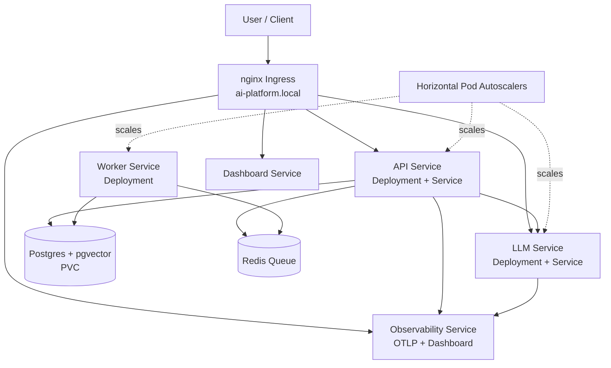

# Kubernetes AI Platform Architecture

## Component Diagram



## Request Flow

```text
Ingress
  -> API service
      -> LLM service
      -> Vector database / Postgres
      -> Redis queue
      -> Observability collector
```

## Operational Boundaries

| Boundary           | Kubernetes Object                                  |
| ------------------ | -------------------------------------------------- |
| Routing            | Ingress, Services                                  |
| Runtime isolation  | Deployments, Pods                                  |
| Configuration      | ConfigMap                                          |
| Sensitive settings | Secret                                             |
| Persistence        | PersistentVolumeClaim                              |
| Scaling            | HorizontalPodAutoscaler                            |
| Safety             | Resource requests/limits, probes, network policies |
