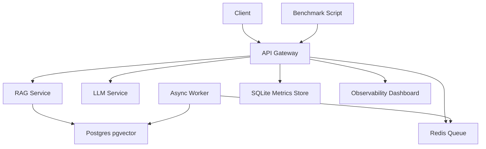
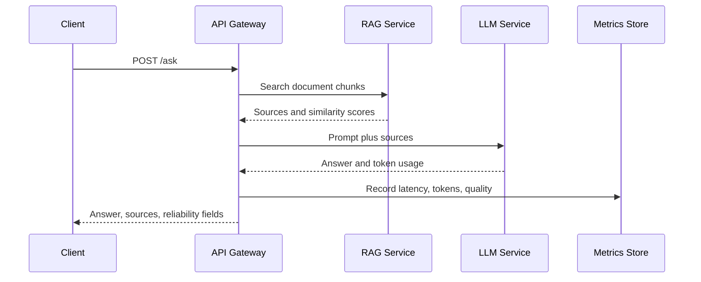
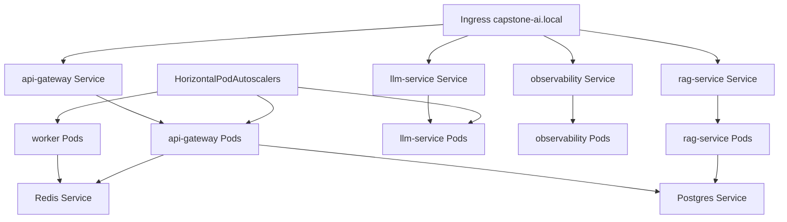

# Capstone Architecture Diagrams

## Platform Component Diagram

```mermaid
flowchart TB
    client["Client"] --> apiGateway["API Gateway"]
    apiGateway --> ragService["RAG Service"]
    ragService --> postgres["Postgres pgvector"]
    apiGateway --> llmService["LLM Service"]
    apiGateway --> redis["Redis Queue"]
    worker["Async Worker"] --> redis
    worker --> postgres
    apiGateway --> metricsStore["SQLite Metrics Store"]
    apiGateway --> dashboard["Observability Dashboard"]
    benchmark["Benchmark Script"] --> apiGateway
```

## Request Flow

```mermaid
sequenceDiagram
    participant Client
    participant API as API Gateway
    participant RAG as RAG Service
    participant LLM as LLM Service
    participant Metrics as Metrics Store

    Client->>API: POST /ask
    API->>RAG: Search document chunks
    RAG-->>API: Sources and similarity scores
    API->>LLM: Prompt plus sources
    LLM-->>API: Answer and token usage
    API->>Metrics: Record latency, tokens, quality
    API-->>Client: Answer, sources, reliability fields
```

## Kubernetes Topology

```mermaid
flowchart TB
    ingress["Ingress capstone-ai.local"] --> apiSvc["api-gateway Service"]
    ingress --> ragSvc["rag-service Service"]
    ingress --> llmSvc["llm-service Service"]
    ingress --> obsSvc["observability Service"]
    apiSvc --> apiPods["api-gateway Pods"]
    ragSvc --> ragPods["rag-service Pods"]
    llmSvc --> llmPods["llm-service Pods"]
    obsSvc --> obsPods["observability Pods"]
    workerPods["worker Pods"] --> redisSvc["Redis Service"]
    apiPods --> redisSvc
    apiPods --> postgresSvc["Postgres Service"]
    ragPods --> postgresSvc
    hpa["HorizontalPodAutoscalers"] --> apiPods
    hpa --> workerPods
    hpa --> llmPods
```
