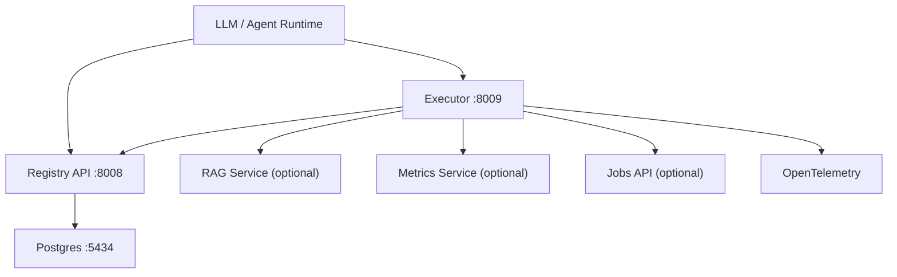
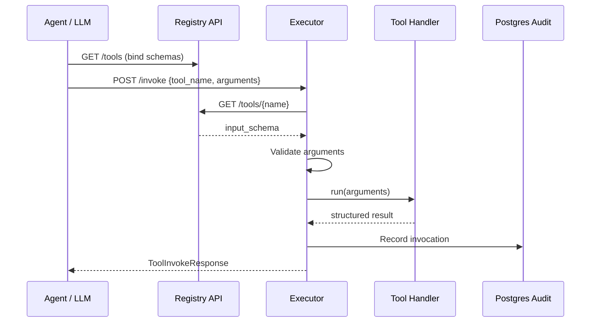

# Tool Registry Diagrams

## Component Diagram

```mermaid
flowchart TB
    llm["LLM / Agent Runtime"] --> registry["Registry API :8008"]
    llm --> executor["Executor :8009"]
    executor --> registry
    registry --> postgres["Postgres :5434"]
    executor --> rag["RAG Service (optional)"]
    executor --> metrics["Metrics Service (optional)"]
    executor --> jobs["Jobs API (optional)"]
    executor --> otel["OpenTelemetry"]
```

## Invoke Sequence

```mermaid
sequenceDiagram
    participant Agent as Agent / LLM
    participant Registry as Registry API
    participant Executor as Executor
    participant Handler as Tool Handler
    participant Audit as Postgres Audit

    Agent->>Registry: GET /tools (bind schemas)
    Agent->>Executor: POST /invoke {tool_name, arguments}
    Executor->>Registry: GET /tools/{name}
    Registry-->>Executor: input_schema
    Executor->>Executor: Validate arguments
    Executor->>Handler: run(arguments)
    Handler-->>Executor: structured result
    Executor->>Audit: Record invocation
    Executor-->>Agent: ToolInvokeResponse
```
