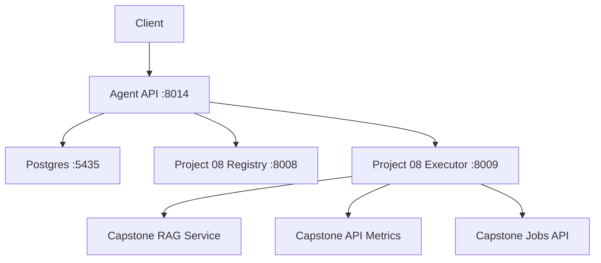
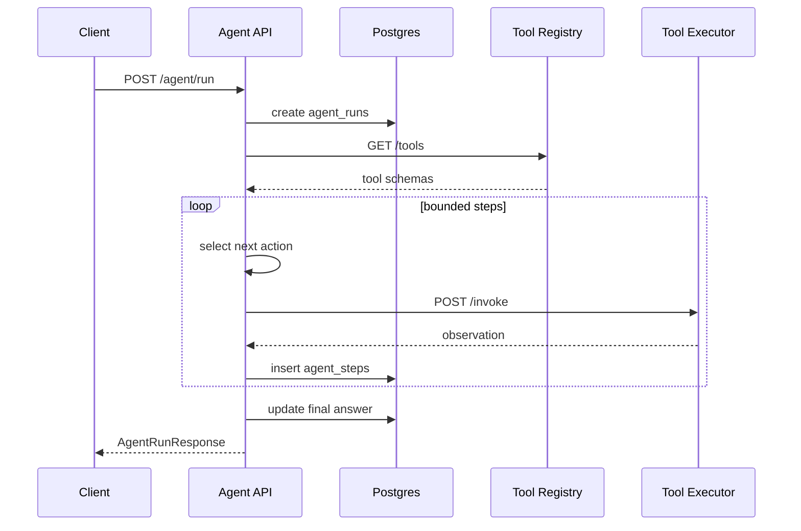

# Single-Agent ReAct Diagrams

## Component Diagram

```mermaid
flowchart TB
    client["Client"] --> agent["Agent API :8014"]
    agent --> db["Postgres :5435"]
    agent --> registry["Project 08 Registry :8008"]
    agent --> executor["Project 08 Executor :8009"]
    executor --> rag["Capstone RAG Service"]
    executor --> metrics["Capstone API Metrics"]
    executor --> jobs["Capstone Jobs API"]
```

## Agent Run Sequence

```mermaid
sequenceDiagram
    participant Client
    participant Agent as Agent API
    participant DB as Postgres
    participant Registry as Tool Registry
    participant Executor as Tool Executor

    Client->>Agent: POST /agent/run
    Agent->>DB: create agent_runs
    Agent->>Registry: GET /tools
    Registry-->>Agent: tool schemas
    loop bounded steps
        Agent->>Agent: select next action
        Agent->>Executor: POST /invoke
        Executor-->>Agent: observation
        Agent->>DB: insert agent_steps
    end
    Agent->>DB: update final answer
    Agent-->>Client: AgentRunResponse
```
