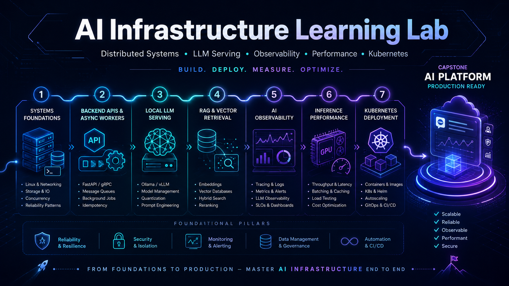

# AI Infrastructure Learning Lab

This repository documents my hands-on learning path into **AI infrastructure, LLM serving, observability, distributed systems, and production AI platform engineering**.

The goal of this project series is to build practical systems that strengthen my ability to design, deploy, monitor, and optimize AI-enabled data and application platforms.

Rather than focusing only on theory, this repo is organized around production-style projects that explore:

- Distributed systems fundamentals
- Backend service design
- Dockerized development environments
- Local LLM serving
- Retrieval-augmented generation
- AI observability and tracing
- Performance benchmarking
- Kubernetes-based deployment
- Production AI platform architecture

---

## Purpose

My background is in analytics engineering, AI data platforms, Snowflake/dbt architecture, orchestration, governance, and AI-enabled workflows.

This learning lab is designed to extend that foundation into the infrastructure layer behind modern AI systems.

The core question behind this repo is:

> How do you build reliable, observable, scalable AI systems that can move from local development to production-grade infrastructure?

---

## Learning Roadmap

The projects in this repository are organized into a 24-week roadmap.

Each phase introduces a new layer of AI infrastructure engineering.

| Phase   | Focus                                           | Outcome                                                  |
| ------- | ----------------------------------------------- | -------------------------------------------------------- |
| Phase 1 | Systems, Linux, networking, distributed systems | Understand the foundations of scalable backend platforms |
| Phase 2 | APIs, async jobs, Docker, queues                | Build reliable service-based backend systems             |
| Phase 3 | Local LLM serving and vector retrieval          | Build a working local AI application stack               |
| Phase 4 | AI observability and reliability                | Trace, monitor, and evaluate AI system behavior          |
| Phase 5 | GPU and inference performance                   | Benchmark and reason about model-serving bottlenecks     |
| Phase 6 | Kubernetes and production orchestration         | Deploy a production-style AI platform                    |

---

# Project Portfolio

## 01. Systems Engineering Foundations

### Goal

Build foundational knowledge in Linux, networking, backend systems, and distributed architecture.

### Topics Covered

- Linux processes and filesystems
- Shell scripting
- HTTP, TCP/IP, DNS, and TLS
- Reverse proxies
- Load balancing concepts
- Distributed logs
- Replication and partitioning
- Consistency and fault tolerance

### Deliverables

- Linux command reference
- Networking request lifecycle diagram
- Distributed systems notes
- Architecture breakdowns from _Designing Data-Intensive Applications_

### Example Output

```
browser request
  -> DNS resolution
  -> TLS handshake
  -> reverse proxy
  -> API service
  -> database/cache/model service
  -> response
```

---

## 02. Backend API + Async Worker System

### Goal

Build a production-style backend service with async job processing.

### System Components

- API service
- Worker service
- Redis or RabbitMQ queue
- PostgreSQL database
- Docker Compose environment
- Health checks
- Structured logging

### Features

- REST API endpoints
- Request validation
- Background job submission
- Async task processing
- Job status tracking
- Error handling
- Local containerized development

### Deliverables

- Dockerized backend application
- Queue-based worker system
- API documentation
- Architecture diagram
- README explaining local setup

### Example Stack

```text
FastAPI or Express
PostgreSQL
Redis
Docker Compose
OpenAPI / Swagger
```

---

## 03. Local LLM Serving Lab

### Goal

Understand how local LLM inference works by running and benchmarking local models.

### Topics Covered

- Tokenization
- Context windows
- Prompt streaming
- Model serving
- Quantization
- CPU vs GPU inference
- Latency and throughput
- Model response benchmarking

### Tools Explored

- Ollama
- llama.cpp
- Hugging Face Text Generation Inference
- vLLM concepts

### Deliverables

- [Local LLM API wrapper](./03-local-llm-serving-lab/api/app/)
- [Streaming response endpoint](./03-local-llm-serving-lab/api/app/main.py)
- [Model comparison notes](./03-local-llm-serving-lab/docs/model-comparison-notes.md)
- [Benchmark results](./03-local-llm-serving-lab/docs/benchmark-results.md)
- [Latency and throughput report](./03-local-llm-serving-lab/docs/latency-throughput-report.md)

### Example Benchmarks

| Model         | Runtime   | Quantization | Avg Latency | Tokens/sec |
| ------------- | --------- | ------------ | ----------: | ---------: |
| Llama model   | Ollama    | Q4           |         TBD |        TBD |
| Mistral model | Ollama    | Q4           |         TBD |        TBD |
| Local model   | llama.cpp | Q5           |         TBD |        TBD |

---

## 04. RAG Document Assistant

### Goal

Build a retrieval-augmented generation system over local documents.

### System Components

- Document loader
- Text chunker
- Embedding model
- Vector database
- Retrieval pipeline
- LLM response generator
- API interface

### Topics Covered

- Embeddings
- Chunking strategies
- Vector similarity search
- Cosine similarity
- Prompt augmentation
- Retrieval quality
- Source-grounded answers

### Possible Vector Stores

- Chroma
- Postgres with pgvector
- Qdrant
- FAISS

### Deliverables

- [Markdown/PDF document assistant](./04-rag-document-assistant/api/app/document_loader.py)
- [RAG API endpoint](./04-rag-document-assistant/api/app/main.py)
- [Vector search layer](./04-rag-document-assistant/docs/vector-search-layer.md)
- [Retrieval quality notes](./04-rag-document-assistant/docs/retrieval-quality-notes.md)
- [Prompt template examples](./04-rag-document-assistant/prompts/)

### Example Flow

```text
User question
  -> embed query
  -> search vector database
  -> retrieve relevant chunks
  -> inject context into prompt
  -> generate answer
  -> return response with sources
```

---

## 05. AI Observability Platform

### Goal

Instrument an AI application so model behavior, latency, failures, and token usage can be traced and monitored.

### Topics Covered

- OpenTelemetry
- Distributed tracing
- Spans and traces
- Metrics
- Logs
- Prompt tracing
- Token usage tracking
- AI reliability monitoring

### Tools Explored

- OpenTelemetry
- Langfuse
- Arize Phoenix
- Grafana
- Prometheus

### Features

- Trace API requests end-to-end
- Capture LLM latency
- Track prompt and completion tokens
- Monitor retrieval latency
- Log model errors
- Measure response quality
- Visualize system performance

### Deliverables

- [Instrumented AI API](./05-ai-observability-platform/api/app/main.py)
- [OpenTelemetry traces](./05-ai-observability-platform/docs/opentelemetry-traces.md)
- [Phoenix integration](./05-ai-observability-platform/docs/phoenix-integration.md)
- [Observability dashboard](./05-ai-observability-platform/docs/observability-dashboard.md)
- [AI reliability report](./05-ai-observability-platform/docs/ai-reliability-report.md)

### Example Metrics

| Metric             | Description                          |
| ------------------ | ------------------------------------ |
| Request latency    | Total time from request to response  |
| Model latency      | Time spent generating LLM output     |
| Retrieval latency  | Time spent searching vector store    |
| Token count        | Prompt, completion, and total tokens |
| Error rate         | Failed requests or model exceptions  |
| Retrieval hit rate | Whether useful context was retrieved |

---

## 06. Inference Performance Lab

### Goal

Understand why AI systems become slow and how to measure performance bottlenecks.

### Topics Covered

- Latency vs throughput
- Batching
- Concurrency
- KV cache
- VRAM limits
- Quantization
- CPU/GPU bottlenecks
- Load testing
- Flame graphs
- Profiling basics

### Tools Explored

- vLLM documentation
- NVIDIA CUDA fundamentals
- Brendan Gregg performance engineering material
- k6 or Locust
- Python profiling tools

### Deliverables

- [Load test results](./06-inference-performance-lab/docs/load-test-results.md)
- [Model-serving benchmark report](./06-inference-performance-lab/docs/model-serving-benchmark-report.md)
- [Bottleneck analysis](./06-inference-performance-lab/docs/bottleneck-analysis.md)
- [Before/after optimization notes](./06-inference-performance-lab/docs/before-after-optimization-notes.md)
- [Performance architecture diagram](./06-inference-performance-lab/diagrams/performance-architecture.md)

### Example Questions

- How many concurrent users can this model server handle?
- What happens to latency under load?
- How does quantization affect response time?
- Where does the request spend the most time?
- Is the bottleneck the API, vector store, model runtime, or hardware?

---

## 07. Kubernetes AI Platform Deployment

### Goal

Deploy the AI application stack using Kubernetes.

### Topics Covered

- Pods
- Deployments
- Services
- ConfigMaps
- Secrets
- Ingress
- Horizontal autoscaling
- Resource limits
- Rolling deployments
- Local Kubernetes with kind or minikube

### System Components

- API service
- Worker service
- LLM service
- Vector database
- PostgreSQL
- Redis
- Observability service
- Dashboard

### Deliverables

- [Kubernetes manifests](./07-kubernetes-ai-platform-deployment/manifests/)
- [Local cluster deployment](./07-kubernetes-ai-platform-deployment/kind/kind-cluster.yaml)
- [Ingress configuration](./07-kubernetes-ai-platform-deployment/manifests/30-ingress.yaml)
- [Autoscaling configuration](./07-kubernetes-ai-platform-deployment/manifests/40-autoscaling.yaml)
- [Deployment guide](./07-kubernetes-ai-platform-deployment/docs/deployment-guide.md)
- [Production-readiness checklist](./07-kubernetes-ai-platform-deployment/docs/production-readiness-checklist.md)

### Example Architecture

```text
Ingress
  -> API service
      -> LLM service
      -> Vector database
      -> PostgreSQL
      -> Redis queue
      -> Observability collector
```

---

# Capstone Project

## Observable Local LLM Platform

The final capstone combines all previous projects into a single production-style AI infrastructure platform.

### Capstone Goal

Build a local AI platform that can:

- Accept user requests through an API
- Retrieve relevant document context
- Generate responses using a local or hosted LLM
- Process async jobs
- Track traces, metrics, logs, prompts, tokens, and latency
- Benchmark inference performance
- Deploy through Docker and Kubernetes

### Capstone Architecture

```text
Client
  -> API Gateway
      -> Auth / Validation
      -> RAG Pipeline
          -> Embedding Model
          -> Vector Database
          -> Document Store
      -> LLM Service
      -> Async Worker
      -> PostgreSQL
      -> Redis Queue
      -> OpenTelemetry Collector
      -> Langfuse / Phoenix
      -> Metrics Dashboard
```

### Capstone Deliverables

- [Full source code](./capstone-observable-llm-platform/)
- [Docker Compose setup](./capstone-observable-llm-platform/docker-compose.yml)
- [Kubernetes deployment files](./capstone-observable-llm-platform/kubernetes/manifests/)
- [Architecture diagrams](./capstone-observable-llm-platform/diagrams/capstone-architecture.md)
- [Benchmark report](./capstone-observable-llm-platform/benchmarks/benchmark-report.md)
- [Observability dashboard screenshots](./capstone-observable-llm-platform/docs/screenshots/)
- [Technical writeup](./capstone-observable-llm-platform/article/observable-local-llm-platform-article.md)
- [LinkedIn project summary](./capstone-observable-llm-platform/article/linkedin-summary.md)
- [GitHub documentation](./capstone-observable-llm-platform/README.md)

---

# Repository Structure

```text
ai-infrastructure-learning-lab/
│
├── 01-systems-foundations/
│   ├── linux-notes.md
│   ├── networking-notes.md
│   ├── distributed-systems-notes.md
│   └── diagrams/
│
├── 02-backend-api-worker/
│   ├── api/
│   ├── worker/
│   ├── docker-compose.yml
│   └── README.md
│
├── 03-local-llm-serving/
│   ├── ollama-api/
│   ├── llama-cpp-notes/
│   ├── benchmarks/
│   └── README.md
│
├── 04-rag-document-assistant/
│   ├── app/
│   ├── embeddings/
│   ├── vector-store/
│   ├── prompts/
│   └── README.md
│
├── 05-ai-observability-platform/
│   ├── telemetry/
│   ├── langfuse/
│   ├── phoenix/
│   ├── dashboards/
│   └── README.md
│
├── 06-inference-performance-lab/
│   ├── load-tests/
│   ├── benchmark-results/
│   ├── profiling-notes/
│   └── README.md
│
├── 07-kubernetes-ai-platform/
│   ├── manifests/
│   ├── helm/
│   ├── ingress/
│   ├── autoscaling/
│   └── README.md
│
├── capstone-observable-llm-platform/
│   ├── api/
│   ├── worker/
│   ├── llm-service/
│   ├── rag-service/
│   ├── vector-db/
│   ├── observability/
│   ├── kubernetes/
│   ├── docker-compose.yml
│   └── README.md
│
└── README.md
```

---

# Skills Developed

By completing these projects, this repository will demonstrate hands-on experience with:

- AI infrastructure engineering
- LLMOps
- Backend service design
- Distributed systems
- API architecture
- Async processing
- Docker
- Kubernetes
- Local model serving
- Vector retrieval
- RAG systems
- OpenTelemetry
- AI observability
- Model-serving benchmarks
- System performance analysis
- Production AI platform design

---

# Target Roles

This project portfolio is designed to support growth toward roles such as:

- AI Platform Engineer
- AI Infrastructure Engineer
- LLMOps Engineer
- AI Data Platform Architect
- AI Reliability Engineer
- Backend Engineer, AI Systems
- Data Platform Engineer
- Intelligent Analytics Platform Architect

---

# Learning Principles

This repository follows a build-first approach:

1. Learn the concept
2. Build a small system
3. Deploy it locally
4. Break it under load
5. Measure the bottlenecks
6. Improve the design
7. Document the results publicly

The emphasis is not on completing tutorials.

The emphasis is on building systems that demonstrate practical AI infrastructure capability.

---

# Progress Tracker

| Project                                | Status      |
| -------------------------------------- | ----------- |
| Systems Engineering Foundations        | Not Started |
| Backend API + Async Worker             | Not Started |
| Local LLM Serving Lab                  | Not Started |
| RAG Document Assistant                 | Not Started |
| AI Observability Platform              | Not Started |
| Inference Performance Lab              | Not Started |
| Kubernetes AI Platform Deployment      | Not Started |
| Observable Local LLM Platform Capstone | Completed   |

---

# Documentation Goals

For each project, I plan to document:

- What I built
- Why it matters
- Architecture decisions
- Tools used
- Setup instructions
- Problems encountered
- Performance results
- Lessons learned
- Next improvements

---

# Public Learning Outputs

This repo may also support public technical writing, including:

- GitHub project writeups
- Architecture diagrams
- LinkedIn posts
- Benchmark reports
- System design breakdowns
- AI infrastructure notes

---

# Long-Term Objective

The long-term objective is to build a portfolio that demonstrates practical competence in AI infrastructure and platform engineering.

By the end of this roadmap, this repository should show that I can design, build, observe, benchmark, and deploy AI-enabled systems using modern infrastructure patterns.

```

```
