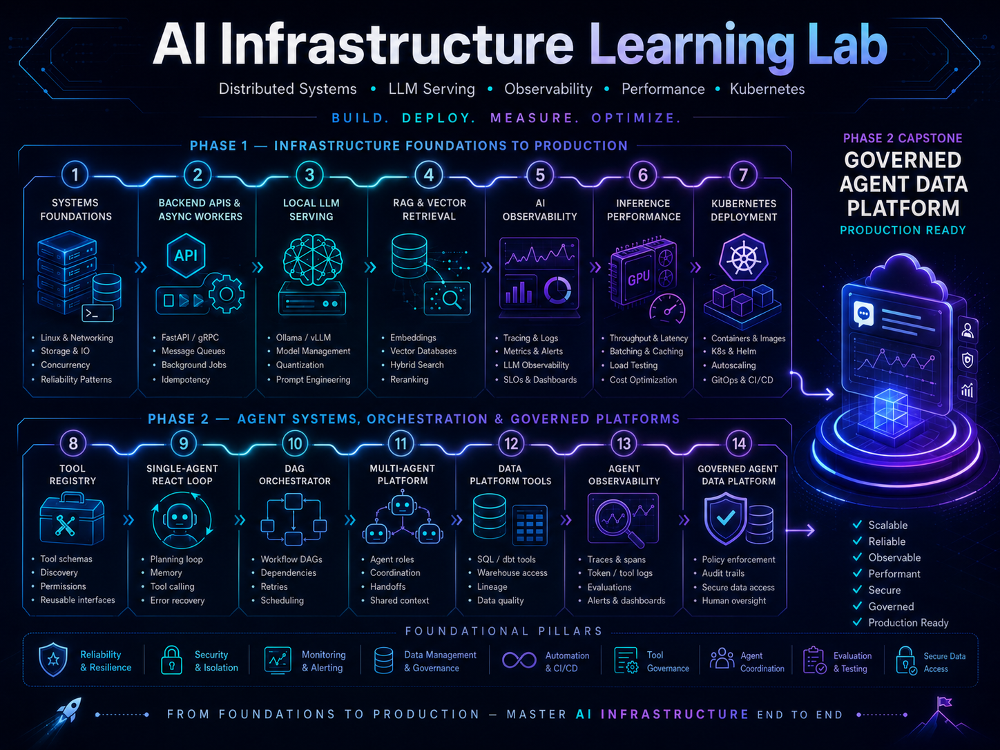

# AI Infrastructure Learning Lab

This repository documents my hands-on learning path into **AI infrastructure, LLM serving, observability, distributed systems, and production AI platform engineering**.

The goal of this project series is to build practical systems that strengthen my ability to design, deploy, monitor, and optimize AI-enabled data and application platforms.

Rather than focusing only on theory, this repo is organized around production-style projects that explore:

- Distributed systems fundamentals
- Backend service design
- Dockerized development environments
- Local LLM serving
- Retrieval-augmented generation
- AI observability and tracing
- Performance benchmarking
- Kubernetes-based deployment
- Production AI platform architecture

---

## Purpose

My background is in analytics engineering, AI data platforms, Snowflake/dbt architecture, orchestration, governance, and AI-enabled workflows.

This learning lab is designed to extend that foundation into the infrastructure layer behind modern AI systems.

The core question behind this repo is:

> How do you build reliable, observable, scalable AI systems that can move from local development to production-grade infrastructure?

---

## Learning Roadmap

The projects in this repository are organized into a 24-week roadmap.

Each phase introduces a new layer of AI infrastructure engineering.

| Phase   | Focus                                           | Outcome                                                  |
| ------- | ----------------------------------------------- | -------------------------------------------------------- |
| Phase 1 | Systems, Linux, networking, distributed systems | Understand the foundations of scalable backend platforms |
| Phase 2 | APIs, async jobs, Docker, queues                | Build reliable service-based backend systems             |
| Phase 3 | Local LLM serving and vector retrieval          | Build a working local AI application stack               |
| Phase 4 | AI observability and reliability                | Trace, monitor, and evaluate AI system behavior          |
| Phase 5 | GPU and inference performance                   | Benchmark and reason about model-serving bottlenecks     |
| Phase 6 | Kubernetes and production orchestration         | Deploy a production-style AI platform                    |

### Phase 2 Series: Agentic AI Data Platform (Projects 08–14)

Phase 1 established a reliable, observable, deployable LLM platform. Phase 2 extends that foundation into **multi-agent orchestration, tool calling, and DAG-based workflows** for AI data platform infrastructure.

| Phase 2 Project | Focus                                       | Outcome                                                     |
| --------------- | ------------------------------------------- | ----------------------------------------------------------- |
| 08              | Tool registry and execution layer           | Structured tools as first-class platform infrastructure     |
| 09              | Single-agent ReAct loop                     | Plan → act → observe agent control flow                     |
| 10              | DAG workflow orchestrator                   | Dependency-aware agent task orchestration with replay       |
| 11              | Multi-agent coordination platform           | Supervisor and specialist agents with governed handoffs     |
| 12              | Data platform tool layer                    | SQL, dbt, and catalog tools with governance and audit       |
| 13              | Agent and DAG observability                 | Trace trees, eval harness, and reliability metrics per node |
| 14              | Governed multi-agent data platform capstone | End-to-end agentic data platform on Docker and Kubernetes   |

---

# Project Portfolio

## 01. Systems Engineering Foundations

### Goal

Build foundational knowledge in Linux, networking, backend systems, and distributed architecture.

### Topics Covered

- Linux processes and filesystems
- Shell scripting
- HTTP, TCP/IP, DNS, and TLS
- Reverse proxies
- Load balancing concepts
- Distributed logs
- Replication and partitioning
- Consistency and fault tolerance

### Deliverables

- Linux command reference
- Networking request lifecycle diagram
- Distributed systems notes
- Architecture breakdowns from _Designing Data-Intensive Applications_

### Example Output

```
browser request
  -> DNS resolution
  -> TLS handshake
  -> reverse proxy
  -> API service
  -> database/cache/model service
  -> response
```

---

## 02. Backend API + Async Worker System

### Goal

Build a production-style backend service with async job processing.

### System Components

- API service
- Worker service
- Redis or RabbitMQ queue
- PostgreSQL database
- Docker Compose environment
- Health checks
- Structured logging

### Features

- REST API endpoints
- Request validation
- Background job submission
- Async task processing
- Job status tracking
- Error handling
- Local containerized development

### Deliverables

- Dockerized backend application
- Queue-based worker system
- API documentation
- Architecture diagram
- README explaining local setup

### Example Stack

```text
FastAPI or Express
PostgreSQL
Redis
Docker Compose
OpenAPI / Swagger
```

---

## 03. Local LLM Serving Lab

### Goal

Understand how local LLM inference works by running and benchmarking local models.

### Topics Covered

- Tokenization
- Context windows
- Prompt streaming
- Model serving
- Quantization
- CPU vs GPU inference
- Latency and throughput
- Model response benchmarking

### Tools Explored

- Ollama
- llama.cpp
- Hugging Face Text Generation Inference
- vLLM concepts

### Deliverables

- [Local LLM API wrapper](./03-local-llm-serving-lab/api/app/)
- [Streaming response endpoint](./03-local-llm-serving-lab/api/app/main.py)
- [Model comparison notes](./03-local-llm-serving-lab/docs/model-comparison-notes.md)
- [Benchmark results](./03-local-llm-serving-lab/docs/benchmark-results.md)
- [Latency and throughput report](./03-local-llm-serving-lab/docs/latency-throughput-report.md)

### Example Benchmarks

| Model         | Runtime   | Quantization | Avg Latency | Tokens/sec |
| ------------- | --------- | ------------ | ----------: | ---------: |
| Llama model   | Ollama    | Q4           |         TBD |        TBD |
| Mistral model | Ollama    | Q4           |         TBD |        TBD |
| Local model   | llama.cpp | Q5           |         TBD |        TBD |

---

## 04. RAG Document Assistant

### Goal

Build a retrieval-augmented generation system over local documents.

### System Components

- Document loader
- Text chunker
- Embedding model
- Vector database
- Retrieval pipeline
- LLM response generator
- API interface

### Topics Covered

- Embeddings
- Chunking strategies
- Vector similarity search
- Cosine similarity
- Prompt augmentation
- Retrieval quality
- Source-grounded answers

### Possible Vector Stores

- Chroma
- Postgres with pgvector
- Qdrant
- FAISS

### Deliverables

- [Markdown/PDF document assistant](./04-rag-document-assistant/api/app/document_loader.py)
- [RAG API endpoint](./04-rag-document-assistant/api/app/main.py)
- [Vector search layer](./04-rag-document-assistant/docs/vector-search-layer.md)
- [Retrieval quality notes](./04-rag-document-assistant/docs/retrieval-quality-notes.md)
- [Prompt template examples](./04-rag-document-assistant/prompts/)

### Example Flow

```text
User question
  -> embed query
  -> search vector database
  -> retrieve relevant chunks
  -> inject context into prompt
  -> generate answer
  -> return response with sources
```

---

## 05. AI Observability Platform

### Goal

Instrument an AI application so model behavior, latency, failures, and token usage can be traced and monitored.

### Topics Covered

- OpenTelemetry
- Distributed tracing
- Spans and traces
- Metrics
- Logs
- Prompt tracing
- Token usage tracking
- AI reliability monitoring

### Tools Explored

- OpenTelemetry
- Langfuse
- Arize Phoenix
- Grafana
- Prometheus

### Features

- Trace API requests end-to-end
- Capture LLM latency
- Track prompt and completion tokens
- Monitor retrieval latency
- Log model errors
- Measure response quality
- Visualize system performance

### Deliverables

- [Instrumented AI API](./05-ai-observability-platform/api/app/main.py)
- [OpenTelemetry traces](./05-ai-observability-platform/docs/opentelemetry-traces.md)
- [Phoenix integration](./05-ai-observability-platform/docs/phoenix-integration.md)
- [Observability dashboard](./05-ai-observability-platform/docs/observability-dashboard.md)
- [AI reliability report](./05-ai-observability-platform/docs/ai-reliability-report.md)

### Example Metrics

| Metric             | Description                          |
| ------------------ | ------------------------------------ |
| Request latency    | Total time from request to response  |
| Model latency      | Time spent generating LLM output     |
| Retrieval latency  | Time spent searching vector store    |
| Token count        | Prompt, completion, and total tokens |
| Error rate         | Failed requests or model exceptions  |
| Retrieval hit rate | Whether useful context was retrieved |

---

## 06. Inference Performance Lab

### Goal

Understand why AI systems become slow and how to measure performance bottlenecks.

### Topics Covered

- Latency vs throughput
- Batching
- Concurrency
- KV cache
- VRAM limits
- Quantization
- CPU/GPU bottlenecks
- Load testing
- Flame graphs
- Profiling basics

### Tools Explored

- vLLM documentation
- NVIDIA CUDA fundamentals
- Brendan Gregg performance engineering material
- k6 or Locust
- Python profiling tools

### Deliverables

- [Load test results](./06-inference-performance-lab/docs/load-test-results.md)
- [Model-serving benchmark report](./06-inference-performance-lab/docs/model-serving-benchmark-report.md)
- [Bottleneck analysis](./06-inference-performance-lab/docs/bottleneck-analysis.md)
- [Before/after optimization notes](./06-inference-performance-lab/docs/before-after-optimization-notes.md)
- [Performance architecture diagram](./06-inference-performance-lab/diagrams/performance-architecture.md)

### Example Questions

- How many concurrent users can this model server handle?
- What happens to latency under load?
- How does quantization affect response time?
- Where does the request spend the most time?
- Is the bottleneck the API, vector store, model runtime, or hardware?

---

## 07. Kubernetes AI Platform Deployment

### Goal

Deploy the AI application stack using Kubernetes.

### Topics Covered

- Pods
- Deployments
- Services
- ConfigMaps
- Secrets
- Ingress
- Horizontal autoscaling
- Resource limits
- Rolling deployments
- Local Kubernetes with kind or minikube

### System Components

- API service
- Worker service
- LLM service
- Vector database
- PostgreSQL
- Redis
- Observability service
- Dashboard

### Deliverables

- [Kubernetes manifests](./07-kubernetes-ai-platform-deployment/manifests/)
- [Local cluster deployment](./07-kubernetes-ai-platform-deployment/kind/kind-cluster.yaml)
- [Ingress configuration](./07-kubernetes-ai-platform-deployment/manifests/30-ingress.yaml)
- [Autoscaling configuration](./07-kubernetes-ai-platform-deployment/manifests/40-autoscaling.yaml)
- [Deployment guide](./07-kubernetes-ai-platform-deployment/docs/deployment-guide.md)
- [Production-readiness checklist](./07-kubernetes-ai-platform-deployment/docs/production-readiness-checklist.md)

### Example Architecture

```text
Ingress
  -> API service
      -> LLM service
      -> Vector database
      -> PostgreSQL
      -> Redis queue
      -> Observability collector
```

---

# Capstone Project

## Observable Local LLM Platform

The final capstone combines all previous projects into a single production-style AI infrastructure platform.

### Capstone Goal

Build a local AI platform that can:

- Accept user requests through an API
- Retrieve relevant document context
- Generate responses using a local or hosted LLM
- Process async jobs
- Track traces, metrics, logs, prompts, tokens, and latency
- Benchmark inference performance
- Deploy through Docker and Kubernetes

### Capstone Architecture

```text
Client
  -> API Gateway
      -> Auth / Validation
      -> RAG Pipeline
          -> Embedding Model
          -> Vector Database
          -> Document Store
      -> LLM Service
      -> Async Worker
      -> PostgreSQL
      -> Redis Queue
      -> OpenTelemetry Collector
      -> Langfuse / Phoenix
      -> Metrics Dashboard
```

### Capstone Deliverables

- [Full source code](./capstone-observable-llm-platform/)
- [Docker Compose setup](./capstone-observable-llm-platform/docker-compose.yml)
- [Kubernetes deployment files](./capstone-observable-llm-platform/kubernetes/manifests/)
- [Architecture diagrams](./capstone-observable-llm-platform/diagrams/capstone-architecture.md)
- [Benchmark report](./capstone-observable-llm-platform/benchmarks/benchmark-report.md)
- [Observability dashboard screenshots](./capstone-observable-llm-platform/docs/screenshots/)
- [Technical writeup](./capstone-observable-llm-platform/article/observable-local-llm-platform-article.md)
- [LinkedIn project summary](./capstone-observable-llm-platform/article/linkedin-summary.md)
- [GitHub documentation](./capstone-observable-llm-platform/README.md)

---

# Phase 2 Project Portfolio

## 08. Tool Registry and Execution Layer

### Goal

Make tools first-class infrastructure so LLMs can invoke structured, observable, auditable functions instead of generating free-form text only.

### System Components

- Tool schema registry (PostgreSQL)
- Tool executor service
- LLM function-calling adapter
- Built-in tools wrapping Phase 1 services (RAG search, metrics, job status)
- OpenTelemetry spans for tool invocations

### Topics Covered

- JSON Schema tool definitions
- OpenAI-compatible function calling
- Tool registration and versioning
- Argument validation and sandboxing
- Tool audit logging
- Rate limits and auth scopes

### Deliverables

- [Tool registry API](./08-tool-registry/api/)
- [Tool executor service](./08-tool-registry/executor/)
- [Built-in tool definitions](./08-tool-registry/tools/)
- [Architecture documentation](./08-tool-registry/docs/architecture.md)
- [Docker Compose setup](./08-tool-registry/docker-compose.yml)

### Example Flow

```text
LLM request with tool schemas
  -> model selects tool + arguments
  -> registry validates schema
  -> executor runs handler
  -> structured result returned to model
  -> span recorded (tool.name, latency, success)
```

---

## 09. Single-Agent ReAct Loop

### Goal

Replace single-shot RAG responses with a bounded agent loop that plans, calls tools, observes results, and synthesizes a final answer.

### System Components

- Agent runtime service
- Step and conversation log (PostgreSQL)
- Integration with Project 08 tool registry
- Token and iteration budgets
- Idempotent tool retries

### Topics Covered

- ReAct prompting patterns
- Agent step budgets and timeouts
- Tool observation injection
- Error classification and recovery
- Single-agent vs single-shot RAG comparison

### Deliverables

- Agent runtime API with full step trace
- Benchmark comparison on scripted questions
- Agent run persistence and replay notes

### Example Flow

```text
User query
  -> LLM (with tool schemas)
  -> [optional] tool call(s)
  -> observation injected
  -> final answer
  (max N iterations, cost budget enforced)
```

---

## 10. DAG Workflow Orchestrator for Agent Tasks

### Goal

Orchestrate tool calls and agent steps as a directed acyclic graph with dependencies, checkpoints, and partial replay.

### System Components

- DAG definition layer (YAML or Python)
- Orchestrator service (topological dispatch)
- Node state store (PostgreSQL)
- Worker pool for node execution
- Fan-in / fan-out and conditional branches

### Topics Covered

- DAG scheduling and dependency resolution
- Checkpointing and failure replay
- Parallel node execution
- Orchestration patterns from data pipelines applied to agents
- State persistence and idempotency

### Deliverables

- Orchestrator service with example DAGs (linear, parallel, conditional)
- Replay-from-failed-node without re-running succeeded upstream nodes
- Architecture diagrams for orchestrator internals

### Example DAG

```text
[retrieve_docs] ──┐
                  ├──► [synthesize_report] ──► [submit_async_job]
[query_metrics] ──┘
```

---

## 11. Multi-Agent Coordination Platform

### Goal

Coordinate specialist agents through a supervisor with governed handoffs, shared context, and role-based tool allowlists.

### System Components

- Supervisor agent (routing and decomposition)
- Specialist agents (researcher, analyst, writer)
- Agent registry with capabilities
- Message bus (Redis Streams)
- Shared context store (PostgreSQL JSONB)

### Topics Covered

- Supervisor / specialist patterns
- Agent-to-agent handoff protocols
- Tool allowlists per agent role
- Cross-agent memory and context sharing
- Delegation and aggregation

### Deliverables

- Multi-agent platform with supervisor and two specialists
- End-to-end demo across RAG, metrics, and synthesis
- Governance documentation for agent roles

### Example Architecture

```text
Supervisor Agent
  -> Researcher Agent (search_docs, fetch_url)
  -> Analyst Agent (query_metrics, run_sql)
  -> Writer Agent (generate_report)
  -> DAG Orchestrator (Project 10)
```

---

## 12. Data Platform Tool Layer

### Goal

Connect agents to governed data platform operations — SQL, schema metadata, dbt lineage, and artifact persistence.

### System Components

- SQL execution tool with validation and allowlists
- Schema and table metadata tools
- dbt manifest and model SQL retrieval
- Query governance middleware (SELECT-only, row limits, PII blocklist)
- Audit log for all data access

### Topics Covered

- Agents as governed data workers
- SQL safety gates and query validation
- dbt lineage as agent context
- Warehouse connector patterns (local Postgres/DuckDB, optional Snowflake)
- Data platform governance and audit trails

### Deliverables

- Data platform tools with governance middleware
- Demo DAG: metrics query → doc retrieval → summary report
- Architecture note on bridging analytics engineering and agent infrastructure

---

## 13. Agent and DAG Observability Platform

### Goal

Extend Phase 1 observability to multi-step agent runs, DAG node execution, and tool-level reliability metrics.

### System Components

- Hierarchical trace model (trace → dag_run → node → tool_call → llm_call)
- Agent and DAG dashboards
- Eval harness for scripted agent scenarios
- Token and cost attribution per node

### Topics Covered

- Agent trace trees and span hierarchy
- Per-tool and per-agent success rates
- DAG flame graphs and bottleneck analysis
- LLM-as-judge task completion scoring
- Failure mode taxonomy (tool timeout, bad SQL, invalid tool args)

### Deliverables

- Extended observability dashboard for agent and DAG traces
- Reliability report with failure mode analysis
- Eval results on 20 scripted agent scenarios

### Example Metrics

| Metric                | Description                               |
| --------------------- | ----------------------------------------- |
| DAG node latency      | Time per node within a DAG run            |
| Tool success rate     | Success/failure by tool and agent         |
| Agent handoff latency | Supervisor to specialist delegation time  |
| Token cost per node   | Prompt and completion tokens per DAG node |
| Replay count          | Nodes re-executed after failure           |

---

## 14. Capstone: Governed Multi-Agent Data Platform

### Goal

Unify Phase 2 projects into a deployable platform that orchestrates multi-agent DAG workflows over governed data platform tools with full observability.

### Capstone Architecture

```text
Client
  -> API Gateway
      -> Supervisor Agent
          -> DAG Orchestrator
              -> Tool Executor
                  -> RAG Service
                  -> LLM Service
                  -> Data Tools (SQL / dbt / metrics)
              -> Specialist Agents
      -> Async Worker (long DAG runs)
      -> PostgreSQL (state, audit, vectors)
      -> Redis (queue + agent messages)
      -> OpenTelemetry -> Phoenix / Langfuse
      -> Dashboard (DAG + agent traces)
```

### Capstone Scenarios

1. Analyze benchmark data and produce a reliability report with sources
2. Given a dbt model question, retrieve lineage and explain dependencies
3. Run a three-agent DAG under load and identify latency bottlenecks

### Capstone Deliverables

- Full source code for governed multi-agent data platform
- Docker Compose and Kubernetes deployment files
- Benchmark and observability reports
- Technical writeup and LinkedIn summary

---

# Repository Structure

```text
ai-infrastructure-learning-lab/
│
├── 01-systems-foundations/
│   ├── linux-notes.md
│   ├── networking-notes.md
│   ├── distributed-systems-notes.md
│   └── diagrams/
│
├── 02-backend-api-worker/
│   ├── api/
│   ├── worker/
│   ├── docker-compose.yml
│   └── README.md
│
├── 03-local-llm-serving/
│   ├── ollama-api/
│   ├── llama-cpp-notes/
│   ├── benchmarks/
│   └── README.md
│
├── 04-rag-document-assistant/
│   ├── app/
│   ├── embeddings/
│   ├── vector-store/
│   ├── prompts/
│   └── README.md
│
├── 05-ai-observability-platform/
│   ├── telemetry/
│   ├── langfuse/
│   ├── phoenix/
│   ├── dashboards/
│   └── README.md
│
├── 06-inference-performance-lab/
│   ├── load-tests/
│   ├── benchmark-results/
│   ├── profiling-notes/
│   └── README.md
│
├── 07-kubernetes-ai-platform/
│   ├── manifests/
│   ├── helm/
│   ├── ingress/
│   ├── autoscaling/
│   └── README.md
│
├── capstone-observable-llm-platform/
│   ├── api/
│   ├── worker/
│   ├── llm-service/
│   ├── rag-service/
│   ├── vector-db/
│   ├── observability/
│   ├── kubernetes/
│   ├── docker-compose.yml
│   └── README.md
│
├── 08-tool-registry/
│   ├── api/
│   ├── executor/
│   ├── tools/
│   ├── sql/
│   ├── docs/
│   ├── diagrams/
│   ├── docker-compose.yml
│   └── README.md
│
├── 09-single-agent-react-loop/
│   ├── api/
│   ├── sql/
│   ├── docs/
│   ├── diagrams/
│   ├── evals/
│   ├── docker-compose.yml
│   └── README.md
│
├── 10-dag-orchestrator/
├── 11-multi-agent-platform/
├── 12-data-platform-tools/
├── 13-agent-observability/
├── 14-governed-agent-data-platform/
│
└── README.md
```

---

# Skills Developed

By completing these projects, this repository will demonstrate hands-on experience with:

- AI infrastructure engineering
- LLMOps
- Backend service design
- Distributed systems
- API architecture
- Async processing
- Docker
- Kubernetes
- Local model serving
- Vector retrieval
- RAG systems
- OpenTelemetry
- AI observability
- Model-serving benchmarks
- System performance analysis
- Production AI platform design
- Tool calling and function schemas
- Agent runtime and ReAct loops
- DAG workflow orchestration
- Multi-agent coordination and handoffs
- Governed data platform tools (SQL, dbt, lineage)
- Agent and DAG observability

---

# Learning Principles

This repository follows a build-first approach:

1. Learn the concept
2. Build a small system
3. Deploy it locally
4. Break it under load
5. Measure the bottlenecks
6. Improve the design
7. Document the results publicly

The emphasis is not on completing tutorials.

The emphasis is on building systems that demonstrate practical AI infrastructure capability.

---

# Progress Tracker

## Phase 1: AI Infrastructure Foundations

| Project                                | Status    |
| -------------------------------------- | --------- |
| Systems Engineering Foundations        | Completed |
| Backend API + Async Worker             | Completed |
| Local LLM Serving Lab                  | Completed |
| RAG Document Assistant                 | Completed |
| AI Observability Platform              | Completed |
| Inference Performance Lab              | Completed |
| Kubernetes AI Platform Deployment      | Completed |
| Observable Local LLM Platform Capstone | Completed |

## Phase 2: Agentic AI Data Platform

| Project                            | Status      |
| ---------------------------------- | ----------- |
| Tool Registry and Execution Layer  | In Progress |
| Single-Agent ReAct Loop            | In Progress |
| DAG Workflow Orchestrator          | Planned     |
| Multi-Agent Coordination Platform  | Planned     |
| Data Platform Tool Layer           | Planned     |
| Agent and DAG Observability        | Planned     |
| Governed Multi-Agent Data Platform | Planned     |

---

# Documentation Goals

For each project, I plan to document:

- What I built
- Why it matters
- Architecture decisions
- Tools used
- Setup instructions
- Problems encountered
- Performance results
- Lessons learned
- Next improvements

---

# Public Learning Outputs

This repo may also support public technical writing, including:

- GitHub project writeups
- Architecture diagrams
- LinkedIn posts
- Benchmark reports
- System design breakdowns
- AI infrastructure notes

---

# Long-Term Objective

The long-term objective is to build a portfolio that demonstrates practical competence in AI infrastructure, agentic platform engineering, and governed AI data systems.

Phase 1 shows that I can design, build, observe, benchmark, and deploy reliable LLM platforms using modern infrastructure patterns.

Phase 2 extends that foundation to show that I can **orchestrate multi-agent workflows with DAG-based tool execution**, connect agents to governed data platform operations, and observe agent behavior at the same rigor as production data pipelines.
